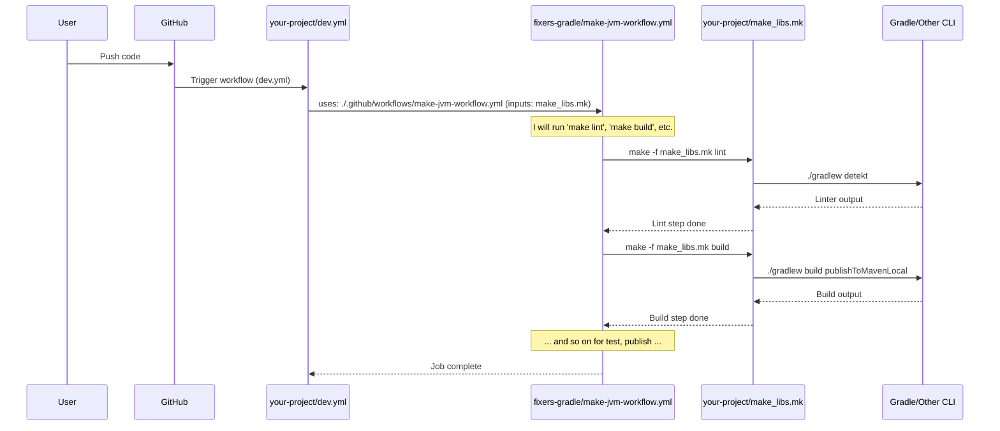

# Chapter 5: Make-Driven Reusable Workflows

Welcome to Chapter 5! In [Chapter 4: Artifact Publishing System](04_artifact_publishing_system_.md), you learned how `fixers-gradle` helps package and share your Kotlin projects. Now, let's explore how we can streamline and standardize the entire lifecycle of tasks like building, testing, and publishing, especially in a CI/CD (Continuous Integration/Continuous Delivery) environment. We'll do this by looking at **Make-Driven Reusable Workflows**.

## The Orchestra Conductor for Your CI/CD

Imagine you're cooking several different meals: one is Italian (like a JVM project), one is Japanese (like a Node.js project), and another is a fancy dessert (like a Storybook documentation site). Each meal has common steps: preparation (linting), cooking (building), taste-testing (testing), and serving (publishing). While the specific ingredients and techniques differ, the overall sequence of actions is similar.

In software projects, especially within a monorepo (a single repository containing multiple projects or modules), you often have these different "types" of projects. You want to ensure that each project, whether it's a backend JVM library, a frontend Node.js application, or a documentation site, goes through a standard set of quality checks and deployment steps.

**Make-Driven Reusable Workflows** are like a master conductor for an orchestra, or a set of master recipes for your kitchen. They provide:
1.  **Standardized CI/CD Pipelines**: Pre-defined templates for common project lifecycles (JVM, Node.js, Storybook).
2.  **Reusability**: These pipelines can be called from other GitHub Actions workflows using the `uses:` syntax.
3.  **Consistency**: They ensure that common tasks like linting, building, testing, and publishing are handled uniformly.
4.  **Make-Powered Execution**: The actual commands for these tasks are defined in `Makefile`s (e.g., `make_libs.mk`, `make_docs.mk`). This separates the "what to do" (defined in Makefiles) from the "how to orchestrate" (defined in the reusable GitHub workflows).

Let's say your **use case** is to set up a consistent CI/CD process for all your JVM libraries. You want every library to be linted, built, tested, and published using the same sequence of steps, even if the specific Gradle commands inside those steps might be slightly different per library.

## Key Ingredients of the Recipe

There are two main components working together here:

1.  **Reusable GitHub Workflows**:
    *   These are `.yml` files (e.g., `make-jvm-workflow.yml`, `make-nodejs-workflow.yml`) stored typically in the `.github/workflows/` directory of your `fixers-gradle` setup.
    *   They define a sequence of CI/CD jobs and steps (like setting up Java, Node.js, checking out code, etc.).
    *   They are designed to be "called" by other workflows in your project. Think of them as generic templates for a CI process.

2.  **Makefiles (`Makefile`, `make_libs.mk`, `make_docs.mk`):**
    *   `make` is a simple yet powerful build automation tool that has been around for decades. A `Makefile` contains a set of "targets" or "recipes." Each target defines a task and the commands to execute that task.
    *   In `fixers-gradle`, Makefiles are used to define the *actual commands* for building, testing, linting, publishing, etc. For example, a `build` target in `make_libs.mk` might simply call `./gradlew build`.
    *   This approach keeps the GitHub Actions YAML files cleaner and delegates the specific command execution to Make.

**How they work together:** The Reusable GitHub Workflow acts as an orchestrator. It sets up the environment and then calls specific targets in a Makefile to perform the actual work.

## Using a Reusable Workflow: The JVM Example

Let's go back to our use case: setting up a standard CI pipeline for a JVM library.

### 1. The Calling Workflow (Your Project's CI Entry Point)

In your project (or monorepo), you'd typically have a simple workflow file, let's call it `dev.yml`, that triggers on pushes or pull requests. This file will *use* one of the reusable workflows provided by `fixers-gradle`.

```yaml
# .github/workflows/dev.yml
name: Dev

on: [push, pull_request] # Triggers on push or pull request

jobs:
  dev:
    uses: ./.github/workflows/make-jvm-workflow.yml # (1)
    with:
      make-file: 'make_libs.mk' # (2)
      on-tag: 'promote'         # (3)
    secrets: # (4)
      GPG_SIGNING_KEY: ${{ secrets.GPG_SIGNING_KEY }}
      # ... other necessary secrets for publishing ...
```
Let's break this down:
1.  `uses: ./.github/workflows/make-jvm-workflow.yml`: This is the magic line! It tells GitHub Actions to run the reusable workflow located at `make-jvm-workflow.yml`. This workflow contains the standard steps for a JVM project lifecycle.
2.  `make-file: 'make_libs.mk'`: This is an *input* to the reusable workflow. It specifies which Makefile contains the targets (like `build`, `test`, `publish`) for this particular job. We'll use `make_libs.mk` for our JVM library.
3.  `on-tag: 'promote'`: Another input. This might control which Make tasks are run when a Git tag is pushed (e.g., run the `promote` Make target when a tag is pushed).
4.  `secrets: ...`: This passes necessary secrets (like GPG keys for signing, tokens for publishing) to the reusable workflow. These secrets are used by the tasks defined in the Makefile (e.g., `./gradlew publish` needs tokens, as seen in [Chapter 4: Artifact Publishing System](04_artifact_publishing_system_.md)).

This `dev.yml` is very concise because all the complex CI logic is encapsulated in `make-jvm-workflow.yml`.

### 2. The Reusable Workflow (`make-jvm-workflow.yml`)

The `make-jvm-workflow.yml` file (which is part of `fixers-gradle`'s shared CI setup) defines the standard sequence of operations for a JVM project. It might look something like this (highly simplified):

```yaml
# .github/workflows/make-jvm-workflow.yml (Simplified)
name: Reusable JVM Development Workflow
on:
  workflow_call: # Makes this workflow reusable
    inputs:
      make-file: # Defines an input parameter
        required: true
        type: string
      # ... other inputs like on-tag, java-version ...
    secrets:
      GPG_SIGNING_KEY:
        required: false
      # ... other secrets ...
jobs:
  run-dev-tasks:
    runs-on: ubuntu-latest
    steps:
      - name: Checkout Repository
        uses: actions/checkout@v4
      - name: Initialize Java and Gradle
        uses: komune-io/fixers-gradle/.github/actions/jvm@main # (1)
        # ... with inputs for Java version ...
      - name: Execute Make Lint Task
        uses: komune-io/fixers-gradle/.github/actions/make-step-prepost@main # (2)
        with:
          make-file: ${{ inputs.make-file }} # (3)
          make-step: 'lint'                  # (4)
      # ... similar steps for build, test, publish, promote ...
      - name: Execute Make Publish Task
        # Conditional execution, e.g., only on main branch or specific tags
        if: github.ref == 'refs/heads/main' || startsWith(github.ref, 'refs/tags/')
        uses: komune-io/fixers-gradle/.github/actions/make-step-prepost@main
        with:
          make-file: ${{ inputs.make-file }}
          make-step: 'publish'
        env: # Pass secrets as environment variables for the make step
          GPG_SIGNING_KEY: ${{ secrets.GPG_SIGNING_KEY }}
          # ...
```
Key parts:
1.  `uses: komune-io/fixers-gradle/.github/actions/jvm@main`: This calls another reusable component, a **Composite Action** (which we'll cover in [Chapter 6: Reusable GitHub Composite Actions](06_reusable_github_composite_actions_.md)), to set up the Java and Gradle environment.
2.  `uses: komune-io/fixers-gradle/.github/actions/make-step-prepost@main`: This is another Composite Action specifically designed to run a Make target.
3.  `make-file: ${{ inputs.make-file }}`: It passes the `make-file` input (which was `make_libs.mk` from our `dev.yml`) to the `make-step-prepost` action.
4.  `make-step: 'lint'`: It tells the `make-step-prepost` action to run the `lint` target from the specified Makefile.

The `make-jvm-workflow.yml` will have similar blocks for `build`, `test`, `publish`, and `promote`, each calling the corresponding Make target.

### 3. The Makefile (`make_libs.mk`)

Now, let's look at `make_libs.mk`. This file defines what `make lint`, `make build`, `make publish`, etc., actually *do* for JVM libraries.

```makefile
# make_libs.mk (Simplified)
VERSION = $(shell cat VERSION) # Gets version from a VERSION file

.PHONY: lint build test publish promote # Declares these as phony targets

lint:
	./gradlew detekt # (1) Runs Detekt for linting

build:
	# Builds the project and publishes to local Maven for testing
	VERSION=$(VERSION) ./gradlew clean build publishToMavenLocal -x test # (2)

test:
	./gradlew test # (3) Runs tests

publish:
	# Publishes to GitHub Packages (example)
	VERSION=$(VERSION) PKG_MAVEN_REPO=github ./gradlew publish --info # (4)

promote:
	# Publishes to Sonatype/Maven Central (example)
	VERSION=$(VERSION) PKG_MAVEN_REPO=sonatype_oss ./gradlew publish # (5)
```
1.  `lint`: The `lint` target simply runs `./gradlew detekt`, leveraging the setup from [Chapter 3: Static Code Analysis and Quality Checks](03_static_code_analysis_and_quality_checks_.md).
2.  `build`: The `build` target runs a Gradle command to clean, build, and publish artifacts to your local Maven repository.
3.  `test`: The `test` target runs `./gradlew test`.
4.  `publish`: The `publish` target runs `./gradlew publish` with specific environment variables to publish to a repository like GitHub Packages. These Gradle tasks are configured by plugins like `PublishPlugin` from [Chapter 4: Artifact Publishing System](04_artifact_publishing_system_.md). The `GPG_SIGNING_KEY` and other secrets passed from `dev.yml` to `make-jvm-workflow.yml` are available as environment variables here.
5.  `promote`: A similar `publish` task, perhaps targeting a different repository like Sonatype for final releases.

**Benefits of this Approach:**
*   **Consistency:** All JVM projects using `make-jvm-workflow.yml` and `make_libs.mk` follow the exact same CI steps.
*   **Simplicity in Project CI:** Your project's `dev.yml` is tiny.
*   **Centralized Logic:** If you need to change how JVM projects are built or tested, you modify `make-jvm-workflow.yml` or `make_libs.mk` in one place.
*   **Flexibility:** Different project types (Node.js, Docs) can have their own Makefiles (e.g., `make_nodejs.mk`, `make_docs.mk`) and corresponding reusable workflows (e.g., `make-nodejs-workflow.yml`).

You can see similar structures for Node.js projects (using `make-nodejs-workflow.yml` and a Makefile calling `npm` or `yarn` commands) or for Storybook documentation (using `publish-storybook-workflow.yml` and `make_docs.mk`).

## Under the Hood: The Orchestration Flow

Let's visualize how these pieces interact when you push code for your JVM library.

1.  **You** push code to your GitHub repository.
2.  **GitHub** detects the push and sees the `.github/workflows/dev.yml` file.
3.  Your `dev.yml` workflow starts and its `dev` job calls the **Reusable Workflow** (`make-jvm-workflow.yml`) using `uses:`, passing inputs like `make-file: 'make_libs.mk'`.
4.  The `make-jvm-workflow.yml` executes its steps:
    *   Checks out code.
    *   Sets up Java/Gradle (using a composite action).
    *   For each lifecycle step (lint, build, test, publish):
        *   It calls the `make-step-prepost` composite action.
        *   This action effectively runs a command like `make -f make_libs.mk lint` (or `build`, `test`, etc.).
5.  The specified **Makefile** (`make_libs.mk`) receives the `make` command.
6.  The corresponding target in `make_libs.mk` (e.g., `lint:`) executes its command (e.g., `./gradlew detekt`).
7.  **Gradle** (or whatever tool is invoked by Make) performs the actual task.

Here's a sequence diagram to illustrate:



### Diving into the Code (Conceptual Snippets)

**1. Your project's trigger workflow (`.github/workflows/dev.yml`):**
This is the entry point.
```yaml
# .github/workflows/dev.yml
jobs:
  dev:
    uses: ./.github/workflows/make-jvm-workflow.yml # Calls the reusable one
    with:
      make-file: 'make_libs.mk' # Tells which Makefile to use
      # ... other inputs & secrets ...
```
This file is super simple, delegating all the heavy lifting.

**2. The Reusable Workflow (`.github/workflows/make-jvm-workflow.yml`):**
This defines the standard steps.
```yaml
# .github/workflows/make-jvm-workflow.yml (snippet)
on:
  workflow_call: # This makes it callable
    inputs:
      make-file:
        type: string
# ...
jobs:
  run-dev-tasks:
    steps:
      # ... setup steps ...
      - name: Execute Make Lint Task
        uses: komune-io/fixers-gradle/.github/actions/make-step-prepost@main
        with:
          make-file: ${{ inputs.make-file }} # Uses the input
          make-step: 'lint' # Specifies the Make target
```
The reusable workflow takes the `make-file` as an input and uses it to call specific Make targets like `lint`, `build`, `test`, `publish`.

**3. The Makefile (`make_libs.mk`):**
This defines the actual commands.
```makefile
# make_libs.mk (snippet)
lint:
	./gradlew detekt

publish:
	# Secrets like PKG_GITHUB_TOKEN are available from env
	VERSION=$(VERSION) PKG_MAVEN_REPO=github ./gradlew publish
```
The Makefile contains the nitty-gritty commands. The Gradle tasks themselves (`detekt`, `publish`) are configured by the `fixers-gradle` plugins as discussed in previous chapters like [Chapter 3: Static Code Analysis and Quality Checks](03_static_code_analysis_and_quality_checks_.md) and [Chapter 4: Artifact Publishing System](04_artifact_publishing_system_.md).

This separation of concerns (orchestration in reusable GitHub workflows, specific commands in Makefiles) makes the CI/CD system robust and easier to manage. If you need to change the linting tool for all JVM projects, you update the `lint` target in `make_libs.mk`. If you need to add a new step to the CI lifecycle for all JVM projects (like a security scan), you add it to `make-jvm-workflow.yml`.

## Conclusion

You've now learned about Make-Driven Reusable Workflows in `fixers-gradle`. These are a powerful way to:
-   **Standardize** CI/CD processes across different types of projects (JVM, Node.js, etc.).
-   **Reuse** common CI/CD logic instead of duplicating it in every project.
-   **Simplify** individual project CI/CD configurations by calling these reusable workflows.
-   **Clearly separate** the orchestration of CI/CD steps (in GitHub Actions reusable workflows) from the actual command execution (in Makefiles).

Think of them as the "master recipes" that combine various ingredients (GitHub Actions steps, Make commands, Gradle tasks) to cook up a full, consistent, and reliable CI process for your projects. This approach brings order and efficiency, especially when managing many components within a larger system.

In the next chapter, we'll zoom in on a specific type of reusable component mentioned here: [Chapter 6: Reusable GitHub Composite Actions](06_reusable_github_composite_actions_.md), which help break down workflows into even smaller, shareable pieces.

---

Generated by [AI Codebase Knowledge Builder](https://github.com/The-Pocket/Tutorial-Codebase-Knowledge)