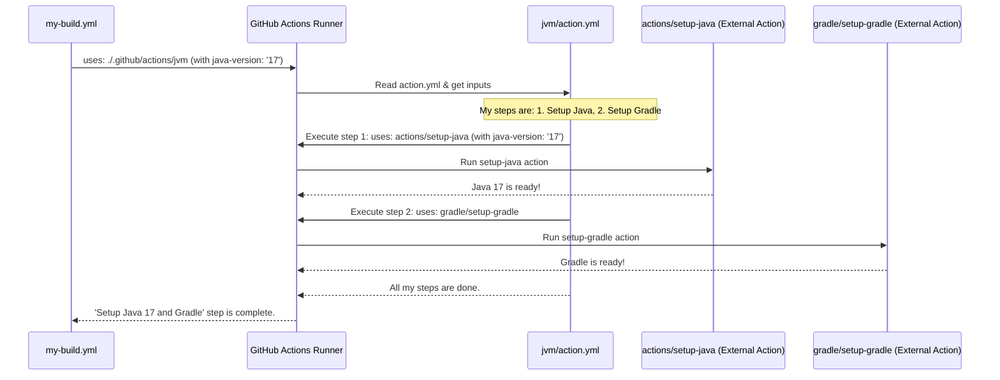

# Chapter 6: Reusable GitHub Composite Actions

In [Chapter 5: Make-Driven Reusable Workflows](05_make_driven_reusable_workflows_.md), we saw how `fixers-gradle` uses Makefiles and reusable GitHub workflows to create standard CI/CD pipelines for different types of projects. This helps keep things consistent. But what if even within those pipelines, there are small, common sets of steps you find yourself repeating? That's where Reusable GitHub Composite Actions come in!

## The Problem: Repeating the Same Small Chores

Imagine you're setting up for different parties (your GitHub Workflows). For every party, whether it's a birthday bash or a quiet dinner, you find yourself doing the exact same initial setup:
1.  Unfold the table.
2.  Lay out the tablecloth.
3.  Place the centerpiece.

In GitHub Workflows, this is like repeatedly writing the same few lines of YAML to, for example:
*   Set up a specific version of Java.
*   Install Node.js and its dependencies.
*   Configure credentials for a service like Chromatic.

While reusable workflows (from Chapter 5) handle the overall party plan, composite actions handle these smaller, repetitive "chore bundles."

**Our Use Case:** Imagine you have several GitHub workflow jobs that all need Java 17 and Gradle set up. Instead of copying the setup steps for Java and Gradle into each job, wouldn't it be nice to have a single, pre-packaged "Java & Gradle Setup Kit"?

## What Are Reusable GitHub Composite Actions?

Reusable GitHub Composite Actions are like specialized, pre-packaged toolkits or "chore bundles" for your GitHub Workflows.
*   **Self-Contained:** Each composite action is defined in its own `action.yml` file and focuses on a specific, small task.
*   **Mini-Workflow:** It's like a tiny workflow with its own steps, which can even call other actions.
*   **Reusable:** You can call a composite action from any of your main GitHub workflow files using a single `uses:` line.

Think of them as creating your own custom LEGO bricks from a few smaller, standard LEGO pieces. Once you've built your custom "Java Setup" brick, you can use it anywhere you need it, making your main LEGO blueprint (your workflow file) cleaner and easier to understand.

`fixers-gradle` provides several such composite actions for common tasks like:
*   Deploying a Storybook to Chromatic (`.github/actions/chromatic/action.yml`).
*   Setting up Gradle to use GitHub Packages for dependencies (`.github/actions/setup-gradle-github-pkg/action.yml`).
*   Managing version tags based on branch names (`.github/actions/version/action.yml`).

This makes your main workflows:
*   **Cleaner:** Less boilerplate, easier to read the overall logic.
*   **More Modular:** Complex logic is hidden inside the composite action.
*   **Easier to Maintain:** If the way to set up Java changes, you only update the "Java Setup" composite action, and all workflows using it benefit.

## Using a Composite Action: The "Java & Gradle Setup Kit"

Let's solve our use case: setting up Java 17 and Gradle. `fixers-gradle` provides a composite action for this in `.github/actions/jvm/action.yml`.

Here's how you'd use it in one of your workflow files:

```yaml
# .github/workflows/my-build.yml
name: My Awesome Build

on: [push]

jobs:
  build-and-test:
    runs-on: ubuntu-latest
    steps:
      - name: Checkout code
        uses: actions/checkout@v4

      - name: Setup Java 17 and Gradle
        uses: komune-io/fixers-gradle/.github/actions/jvm@main # (1)
        with: # (2)
          java-version: '17'
          with-gradle: 'true'
          # We can also set other inputs like with-gradle-build-scan-publish: 'false'

      - name: Build with Gradle
        run: ./gradlew build

      # ... other steps ...
```

Let's break this down:
1.  `uses: komune-io/fixers-gradle/.github/actions/jvm@main`: This line tells GitHub Actions to use the composite action located at `.github/actions/jvm/action.yml` within the `komune-io/fixers-gradle` repository (or your local copy if you're using it from the same repository, like `uses: ./.github/actions/jvm`). The `@main` part means it uses the version of this action from the `main` branch.
2.  `with: ...`: This block provides *inputs* to the composite action.
    *   `java-version: '17'`: We're telling the `jvm` action we want Java version 17.
    *   `with-gradle: 'true'`: We're telling it we also want Gradle to be set up.

**What happens when this step runs?**
The `jvm` composite action takes over. It will:
1.  Use the standard `actions/setup-java` action to install Java 17.
2.  Use the standard `gradle/actions/setup-gradle` action to set up Gradle.
3.  It might also perform other related setup, like configuring Gradle for GitHub Packages, as defined in its `action.yml` file.

After this step, your workflow environment has Java 17 and Gradle ready to go, and your main workflow file (`my-build.yml`) remains short and sweet!

## A Quick Look at Other Composite Actions in `fixers-gradle`

`fixers-gradle` comes with several ready-to-use composite actions. Here are a few examples from the files you've seen:

*   **`.github/actions/chromatic/action.yml`**: This action handles everything needed to deploy your Storybook (a tool for UI component development and documentation, which we'll touch on in [Chapter 8: Documentation & Storybook Workflow](08_documentation___storybook_workflow_.md)) to Chromatic, a visual testing service.
    ```yaml
    # Example usage in a workflow
    - name: Deploy to Chromatic
      uses: ./.github/actions/chromatic
      with:
        storybook-static-dir: 'storybook-static'
        project-token: ${{ secrets.CHROMATIC_PROJECT_TOKEN }}
    ```
*   **`.github/actions/nodejs/action.yml`**: Similar to the `jvm` action, but this one sets up a Node.js environment.
    ```yaml
    # Example usage in a workflow
    - name: Setup Node.js
      uses: ./.github/actions/nodejs
      with:
        node-version: '20'
    ```
*   **`.github/actions/version/action.yml`**: This action is quite handy for managing version strings. It can automatically append suffixes like `-SNAPSHOT` or `-dev-SNAPSHOT` to your project's version based on the current branch. We'll see this more in [Chapter 7: Automated Versioning System](07_automated_versioning_system_.md).
    ```yaml
    # Example usage in a workflow
    - name: Determine Version
      id: version_step # Give it an ID to access outputs
      uses: ./.github/actions/version
      with:
        use-snapshot: 'true'
    - name: Echo version
      run: echo "Version is ${{ steps.version_step.outputs.VERSION }}"
    ```

Each of these encapsulates a specific piece of logic, making your main workflows much more focused on the overall process rather than the tiny details of each step.

## Under the Hood: How Do Composite Actions Work?

It's not magic! It's all defined in a special YAML file named `action.yml` located in the directory of the composite action. This file is the "recipe" for the action.

### The `action.yml` File: The Recipe

When your workflow calls `uses: ./.github/actions/my-composite-action`, GitHub Actions looks for an `action.yml` (or `action.yaml`) file inside the `.github/actions/my-composite-action` directory.

This `action.yml` file describes:
*   `name`: A human-readable name for the action.
*   `description`: What the action does.
*   `inputs`: What parameters the action accepts (like `java-version` in our `jvm` example).
*   `outputs`: What values the action can provide back to the calling workflow (like `VERSION` from the `version` action).
*   `runs`: This is the crucial part. For composite actions, it specifies:
    *   `using: "composite"`: Tells GitHub this is a composite action.
    *   `steps:`: A list of steps to execute, just like in a regular workflow file! These steps can use other actions, run shell commands, etc.

### Step-by-Step: What Happens When You `use` a Composite Action

1.  **Your Workflow Calls:** Your main workflow file has a step like `uses: ./.github/actions/jvm@main`.
2.  **Runner Finds `action.yml`:** The GitHub Actions runner locates the `jvm/action.yml` file.
3.  **Runner Reads `action.yml`:** It reads the inputs, outputs, and the list of steps defined within the composite action's `action.yml`.
4.  **Runner Executes Steps:** The runner executes each step inside the `steps:` block of the composite action, one by one.
    *   It passes any `inputs` from your workflow (e.g., `java-version: '17'`) to the composite action. These inputs are available within the composite action's steps using the `${{ inputs.input_name }}` syntax.
    *   If a step in the composite action sets an output, that output can be made available to the calling workflow.

### A Visual Flow

Here's a simplified sequence of how our `jvm` action example works:



### A Look Inside `.github/actions/jvm/action.yml` (Simplified)

Let's peek at a simplified version of what the `jvm/action.yml` file might look like. The actual file can be found at `.github/actions/jvm/action.yml` in the `fixers-gradle` project.

```yaml
# .github/actions/jvm/action.yml (Simplified)
name: "Initialize Java and Gradle Environment"
description: "Sets up Java and optionally initializes Gradle"

inputs: # (1) Define inputs
  java-version:
    description: 'Java version (e.g., 11, 17)'
    required: false
    default: '17'
  with-gradle:
    description: 'Flag to initialize Gradle'
    required: false
    default: 'true'
  # ... other inputs like with-gradle-build-scan-publish ...

runs: # (2) Define how it runs
  using: "composite" # (3) Mark as a composite action
  steps: # (4) Define the steps it performs
    - name: Setup Java ${{ inputs.java-version }} # (5) Use an input
      uses: actions/setup-java@v4
      with:
        distribution: 'temurin' # A common Java distribution
        java-version: ${{ inputs.java-version }} # Pass the input to setup-java

    - if: inputs.with-gradle == 'true' # (6) Conditional step
      name: Setup Gradle
      uses: gradle/actions/setup-gradle@v3
      with:
        build-scan-publish: true # Example, could be an input too
        # ... other gradle setup options ...

    # It might also include a step to call another composite action, like:
    # - if: inputs.with-setup-gradle-github-pkg == 'true'
    #   name: Setup Gradle with GitHub Packages
    #   uses: komune-io/fixers-gradle/.github/actions/setup-gradle-github-pkg@main
```

Let's break this simplified `action.yml` down:
1.  **`inputs:`**: This section defines the parameters the composite action accepts. We see `java-version` and `with-gradle`. Each input can have a `description`, specify if it's `required`, and provide a `default` value.
2.  **`runs:`**: This section specifies how the action executes.
3.  **`using: "composite"`**: This line is key! It tells GitHub Actions that this `action.yml` defines a composite action.
4.  **`steps:`**: This is a list of steps that the composite action will run, just like in a normal workflow.
5.  **`Setup Java ${{ inputs.java-version }}`**: This step calls the official `actions/setup-java@v4` action. Notice how it uses `${{ inputs.java-version }}` to pass the `java-version` that *our* composite action received as an input to the `setup-java` action.
6.  **`if: inputs.with-gradle == 'true'`**: This step is conditional. It only runs if the `with-gradle` input was set to `'true'`. It then calls the official `gradle/actions/setup-gradle@v3` to set up Gradle.

The actual `jvm/action.yml` also includes logic for setting up GitHub Packages with Gradle by calling *another* composite action (`.github/actions/setup-gradle-github-pkg/action.yml`), demonstrating how composite actions can be nested!

## Conclusion

Reusable GitHub Composite Actions are a fantastic way to make your GitHub Workflows more modular, readable, and maintainable. They allow you to:
-   Encapsulate small, repetitive sequences of steps into their own self-contained units.
-   Call these "toolkits" with a single `uses:` line in your main workflows.
-   Keep your main workflow files clean and focused on the high-level process.
-   Easily update common logic in one place.

By using composite actions for tasks like setting up environments (Java, Node.js), deploying to services (Chromatic, GitHub Pages), or managing versions, `fixers-gradle` helps you build robust and efficient CI/CD pipelines with less effort.

In the next chapter, we'll dive deeper into how `fixers-gradle` handles project versions, especially with the help of actions like the `version` composite action we briefly saw: [Chapter 7: Automated Versioning System](07_automated_versioning_system_.md).

---

Generated by [AI Codebase Knowledge Builder](https://github.com/The-Pocket/Tutorial-Codebase-Knowledge)