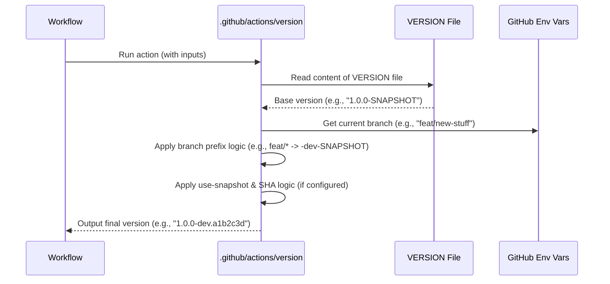

# Chapter 7: Automated Versioning System

Welcome to Chapter 7! In [Chapter 6: Reusable GitHub Composite Actions](06_reusable_github_composite_actions_.md), we explored how `fixers-gradle` uses small, reusable "toolkits" called composite actions to streamline common tasks in your GitHub workflows. One of these very important toolkits helps us with a tricky part of software development: versioning. Let's dive into the **Automated Versioning System**!

## The Headache of Manual Versioning

Imagine you're writing a book and releasing different drafts.
*   Draft 1 for early readers.
*   Draft 1.1 with some fixes.
*   Draft 2, a major rewrite.
*   A special "beta-reader" version of Draft 2.
*   The final "Published Version 2.0".

Keeping track of all these versions, making sure they are labeled correctly and consistently, can be a real headache. If you forget to update a version number or use the wrong label, people might get confused or use an outdated version.

In software, this is even more critical. Every time you build your project, especially in an automated CI/CD environment, you need to assign it a correct version. This version tells you:
-   Is this a stable release?
-   Is it a work-in-progress (snapshot) from the main development line?
-   Is it an experimental build from a feature branch?

Manually updating version numbers in files for every single build or commit is tedious, error-prone, and just not fun.

**Our Use Case**: We want a system that automatically figures out the correct version for our project every time it's built. This version should be meaningful, reflecting whether it's a development snapshot, a pre-release, or a final release, based on where the code comes from (like a specific Git branch or tag).

## Your Intelligent Labeling Machine: The `version` Action

The Automated Versioning System in `fixers-gradle`, primarily embodied in the `version` GitHub Action (found at `.github/actions/version/action.yml`), acts like an intelligent labeling machine for your software.

Here's how it works its magic:
1.  **Base Version from a File**: It starts by reading a base version from a file named `VERSION` in your project's root directory. This file might contain something like `1.0.0-SNAPSHOT`.
2.  **Git-Aware**: It looks at your Git repository's current state:
    *   Which branch is being built (e.g., `main`, `release/1.2.0`, `feat/new-login`)?
    *   Is this build from a Git tag (e.g., `v1.2.0`)?
3.  **Applies Smart Suffixes**: Based on the branch or tag, it modifies the base version with appropriate suffixes:
    *   For `main` branch builds: Often keeps it as `X.Y.Z-SNAPSHOT` (e.g., `1.0.0-SNAPSHOT`).
    *   For feature branches (like `feat/*`, `fix/*`): Might change it to `X.Y.Z-dev-SNAPSHOT` (e.g., `1.0.0-dev-SNAPSHOT`), indicating it's a development build.
    *   For release branches (like `release/*`): Might keep it as `X.Y.Z-SNAPSHOT` while stabilizing for release.
    *   For builds from a release tag (e.g., `v1.0.0`): It helps ensure a clean version like `1.0.0`. (Often, the `VERSION` file itself is updated to the clean version by a release workflow *before* tagging, like the one in `release-workflow.yml`.)
    *   **Unique Snapshots with Git SHA**: For certain snapshot builds (especially useful for things like NPM packages published from feature branches), it can replace `-SNAPSHOT` with a short Git commit hash (SHA), making the version unique, like `1.0.0-dev.a1b2c3d`.

This system ensures consistent and meaningful versioning across all your builds and publications, reducing manual effort and the risk of errors.

## How to Use It: Versioning in Your Workflows

You typically don't call the `version` action directly. Instead, it's used within the reusable workflows provided by `fixers-gradle`, such as `make-jvm-workflow.yml` (from [Chapter 5: Make-Driven Reusable Workflows](05_make_driven_reusable_workflows_.md)).

Let's look at how it's called within `.github/workflows/make-jvm-workflow.yml`:

```yaml
# Inside .github/workflows/make-jvm-workflow.yml (Simplified)
    steps:
      - name: Checkout Repository
        uses: actions/checkout@v4

      # ... other setup steps ...

      - name: Get Version from File
        id: version_step # Give it an ID to access its output
        uses: komune-io/fixers-gradle/.github/actions/version@main # (1)
        # No 'with' block here means it uses default settings

      - name: Echo the version
        run: echo "The determined version is ${{ steps.version_step.outputs.VERSION }}"
```
1.  `uses: komune-io/fixers-gradle/.github/actions/version@main`: This line calls the `version` composite action. Since no specific inputs are provided via a `with:` block, the action uses its default configurations.

**What happens?**
Assuming your `VERSION` file contains `1.2.0-SNAPSHOT`:
*   **On `main` branch**: The action might output `1.2.0-SNAPSHOT`. (Default `with-main-pre-release-tag` is `-SNAPSHOT`).
*   **On `feat/add-button` branch**: The action might output `1.2.0-dev-SNAPSHOT`. (Default `with-feat-pre-release-tag` is `-dev-SNAPSHOT`).
*   **Output**: The determined version string is available as an output of this step: `${{ steps.version_step.outputs.VERSION }}`. This can then be used by subsequent steps, for example, to tag Docker images or name published artifacts.

### Customizing for Unique Snapshot Versions (e.g., for NPM)

Sometimes, especially when publishing development packages (like NPM packages from feature branches), you need a unique version for every commit. The `version` action can be configured for this.

Here's an example from `.github/workflows/make-kotlin-npm-workflow.yml`:
```yaml
# Inside .github/workflows/make-kotlin-npm-workflow.yml (Simplified)
      - name: Get Version from File
        id: version_step
        uses: komune-io/fixers-gradle/.github/actions/version@main
        with:
          use-snapshot: false # (1) Tell it not to use "-SNAPSHOT" literally
          # Define different base suffixes for main/release branches
          with-main-pre-release-tag: '-alpha-SNAPSHOT'
          with-release-pre-release-tag: '-alpha-SNAPSHOT'
          # Use Git SHA for other snapshots if -SNAPSHOT is removed
          with-snapshot-tag: ".${GITHUB_SHA:0:7}" # (2)
```
1.  `use-snapshot: false`: This input tells the action that we don't want the literal string "-SNAPSHOT" in the final version.
2.  `with-snapshot-tag: ".${GITHUB_SHA:0:7}"`: If the logic tries to remove "-SNAPSHOT" (because `use-snapshot` is false), this tag will be appended instead. `${GITHUB_SHA:0:7}` is a GitHub Actions expression that gives the first 7 characters of the commit hash.

**What happens with this configuration?**
Again, assume `VERSION` file is `1.2.0-SNAPSHOT`:
*   **On `feat/new-ui` branch**:
    1.  The branch prefix logic (default `with-feat-pre-release-tag` is `-dev-SNAPSHOT`) would first internally result in `1.2.0-dev-SNAPSHOT`.
    2.  Then, because `use-snapshot: false` is set, the `-SNAPSHOT` part is replaced by the `with-snapshot-tag` value.
    3.  **Output**: `1.2.0-dev.${GITHUB_SHA:0:7}` (e.g., `1.2.0-dev.a1b2c3d`). This is perfect for publishing unique development NPM packages.

This intelligent system ensures that your versions are not just automatic but also correctly formatted for different contexts and needs.

## Under the Hood: How the `version` Action Decides

Let's peek behind the curtain of the `version` composite action.

**Step-by-Step Flow:**

1.  **Workflow Starts**: A GitHub workflow (like `make-jvm-workflow.yml`) triggers and reaches the step that uses the `version` action.
2.  **Action Reads `VERSION` File**: The `version` action's script reads the content of the `VERSION` file (e.g., "1.2.0-SNAPSHOT").
3.  **Action Inspects Git Context**: It checks GitHub Actions environment variables like `GITHUB_REF` (which tells about the current branch or tag) or `GITHUB_HEAD_REF` (for pull requests).
4.  **Action Applies Branch Logic**:
    *   It compares the current branch name against a list of configured `branch-prefixes` (like `main`, `release/`, `feat/`, `fix/`).
    *   If a prefix matches, it takes the corresponding "pre-release tag" (e.g., `-SNAPSHOT` for `main`, `-dev-SNAPSHOT` for `feat/`) from its inputs.
    *   It then replaces the `-SNAPSHOT` part of the version read from the `VERSION` file with this new pre-release tag. For example, if `VERSION` was `1.2.0-SNAPSHOT` and the branch is `feat/login`, it might become `1.2.0-dev-SNAPSHOT`.
5.  **Action Applies `use-snapshot` Logic**:
    *   If the `use-snapshot` input is `false`, it takes the `with-snapshot-tag` input (e.g., `.${GITHUB_SHA:0:7}`).
    *   It then replaces any remaining `-SNAPSHOT` in the version string with this tag. For example, `1.2.0-dev-SNAPSHOT` would become `1.2.0-dev.${GITHUB_SHA:0:7}`.
    *   If `with-snapshot-tag` is empty and `use-snapshot` is `false`, this step effectively removes `-SNAPSHOT`, leading to a clean version like `1.2.0` (assuming the branch logic didn't add a different suffix like `-dev`). This is useful for release builds from tags where the `VERSION` file might temporarily be `1.2.0-SNAPSHOT` before being finalized by `release-workflow.yml`.
6.  **Action Outputs Version**: The final calculated version string is set as an output of the action (e.g., `steps.version.outputs.VERSION`).

**Simplified Sequence Diagram:**



### A Glimpse into `.github/actions/version/action.yml`

The `version` action is a composite action, so its logic is defined in `action.yml`. The core work happens in a `run` step using shell script. Here's a highly simplified idea of what the script does:

```yaml
# .github/actions/version/action.yml (Conceptual Snippet)
# ... inputs defined: use-snapshot, branch-prefixes, with-*-pre-release-tag, with-snapshot-tag ...
outputs:
  VERSION:
    description: "Generated version"
    value: ${{ steps.version.outputs.VERSION }} # Output from a later step
runs:
  using: "composite"
  steps:
    - name: "Set Version Tag for Branch"
      env:
        # GitHub context variables like GITHUB_REF are available here
      run: |
        VERSION_FROM_FILE=$(cat VERSION) # Read from VERSION file
        # Logic to determine CURRENT_BRANCH_NAME based on GITHUB_REF etc.
        # ... (shell script logic) ...

        # Example: Branch prefix logic (very simplified)
        if [[ "$CURRENT_BRANCH_NAME" == "refs/heads/feat/"* ]]; then
          # Replace -SNAPSHOT with the feat prefix (e.g., -dev-SNAPSHOT)
          VERSION_FROM_FILE=${VERSION_FROM_FILE/-SNAPSHOT/"${{ inputs.with-feat-pre-release-tag }}"}
        fi
        # ... (similar logic for other prefixes: main, release, fix) ...

        echo "$VERSION_FROM_FILE" > TEMP_VERSION # Store intermediate version
      shell: bash

    - name: "Set Snapshot Tag (if use-snapshot is false)"
      if: inputs.use-snapshot == 'false'
      run: |
        CURRENT_VERSION=$(cat TEMP_VERSION)
        # Replace -SNAPSHOT with the SHA-based tag
        FINAL_VERSION=${CURRENT_VERSION/-SNAPSHOT/"${{ inputs.with-snapshot-tag }}"}
        echo "$FINAL_VERSION" > TEMP_VERSION
      shell: bash

    - name: "Retrieve Version" # This step actually sets the output
      id: version
      run: |
        FINAL_VERSION_OUTPUT=$(cat TEMP_VERSION)
        echo "VERSION=$FINAL_VERSION_OUTPUT" >> $GITHUB_OUTPUT
      shell: bash
```
This is a conceptual illustration. The actual script in `version/action.yml` is more robust, handling various GitHub event types and carefully parsing inputs. But the core idea is:
1.  Read the base version.
2.  Modify it based on branch-specific rules (replacing the initial `-SNAPSHOT`).
3.  If `use-snapshot: false`, further modify it by replacing any remaining `-SNAPSHOT` with a Git SHA or making it clean.
4.  Output the result.

This automated system, combined with workflows like `release-workflow.yml` (which handles updating the `VERSION` file itself for releases and bumping to the next dev version), provides a comprehensive solution for managing project versions with minimal fuss.

## Conclusion

You've now seen how `fixers-gradle`'s Automated Versioning System, powered by the `version` GitHub Action, acts as an intelligent labeling machine for your project. It:
-   Automatically determines project versions based on Git branches and tags.
-   Reads a base version from a `VERSION` file.
-   Applies meaningful suffixes like `-SNAPSHOT`, `-dev-SNAPSHOT`, or a Git SHA for unique snapshot builds.
-   Ensures consistent versioning, reducing manual effort and errors.

This intelligent versioning is crucial for reliable builds, clear artifact identification, and smooth publishing processes, as we saw in [Chapter 4: Artifact Publishing System](04_artifact_publishing_system_.md). It all ties together to make your development lifecycle more efficient!

Next, we'll explore how `fixers-gradle` helps with another important aspect of software development: creating and maintaining documentation, including interactive UI component showcases using Storybook, in [Chapter 8: Documentation & Storybook Workflow](08_documentation___storybook_workflow_.md).

---

Generated by [AI Codebase Knowledge Builder](https://github.com/The-Pocket/Tutorial-Codebase-Knowledge)