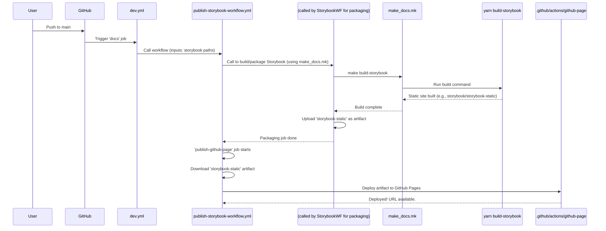

# Chapter 8: Documentation & Storybook Workflow

Welcome to the final chapter of our `fixers-gradle` journey! In [Chapter 7: Automated Versioning System](07_automated_versioning_system_.md), we saw how `fixers-gradle` helps you keep your project versions neat and tidy automatically. Now, let's talk about showing off your hard work: creating and sharing documentation, especially for your cool UI components using Storybook.

## Why Bother with Documentation? The "How-To" Guide for Your Creations

Imagine you've built an amazing, intricate LEGO model. It's fantastic! But what if someone else (or even you, a few months later!) wants to understand how it's built, what all the cool features are, or how to use a specific part of it? Without instructions or a showcase, it's much harder for them to appreciate or use your creation.

Software projects are similar. Good documentation helps users and other developers understand:
-   What your project does.
-   How to set it up and use it.
-   How different parts (like UI components) work and look.

**Our Use Case**: Let's say you're building a web application with lots of reusable UI components like buttons, forms, and cards. You want an easy way to:
1.  Visually browse these components.
2.  See how they look with different settings (e.g., a "primary" button vs. a "danger" button).
3.  Have a live, interactive "gallery" of these components that anyone can access online.
4.  Automate the process of building and publishing this gallery whenever you update your components.

This is where the **Documentation & Storybook Workflow** in `fixers-gradle` shines!

## Key Ingredients for Your Documentation Showcase

`fixers-gradle` orchestrates a few tools and processes to make this happen:

1.  **Storybook**:
    *   Think of Storybook as an interactive workshop or an art gallery specifically for your UI components (like those built with React, Vue, Angular, etc., often developed in Kotlin/JS projects).
    *   It lets you develop and showcase components in isolation. You can see how they look, interact with them, and document their different states and properties.
    *   The output of Storybook is a static website – a collection of HTML, CSS, and JavaScript files that can be hosted anywhere.

2.  **`make_docs.mk` (The "Recipe Book" for Docs)**:
    *   As we learned in [Chapter 5: Make-Driven Reusable Workflows](05_make_driven_reusable_workflows_.md), Makefiles define *how* to do things.
    *   `make_docs.mk` typically contains the specific commands to build your Storybook. For example, it might have a target like `build-storybook` that runs `yarn build-storybook`.
    *   Your `storybook/` directory in the project would contain the actual Storybook configuration and stories.

3.  **`publish-storybook-workflow.yml` (The "Automated Publisher")**:
    *   This is a Reusable GitHub Workflow, like those we discussed in Chapter 5. It's the master plan for automatically building your Storybook and deploying it.
    *   It usually calls another workflow (like `make-nodejs-workflow.yml`) which in turn uses the `make_docs.mk` file to build the Storybook.
    *   Then, it takes the built static Storybook site and deploys it.

4.  **GitHub Pages (Your Free Online Gallery Space)**:
    *   GitHub Pages is a service by GitHub that lets you host static websites directly from your GitHub repository. It's a perfect place to publish your Storybook documentation for free.
    *   The `publish-storybook-workflow.yml` uses a composite action (`.github/actions/github-page/action.yml`) to deploy to GitHub Pages.

5.  **Chromatic (Optional: Supercharged Storybook Hosting & Visual Testing)**:
    *   Chromatic is a service that works closely with Storybook. It can host your Storybook, but more importantly, it provides visual regression testing – it takes snapshots of your components and alerts you if they change unexpectedly.
    *   The `publish-storybook-workflow.yml` can optionally deploy to Chromatic using another composite action (`.github/actions/chromatic/action.yml`).

This system creates an automated pipeline: you make changes to your UI components, push your code, and your documentation gallery gets updated automatically!

## How to Use It: Setting Up Your Automated Component Showcase

Let's walk through how you'd typically get this running for your Storybook.

### 1. Your Project's CI Entry Point (e.g., `dev.yml`)

You'll have a main CI workflow file in your project, like `.github/workflows/dev.yml`, that calls the `publish-storybook-workflow.yml`.

```yaml
# .github/workflows/dev.yml (snippet for docs)
jobs:
  # ... other jobs like 'dev' for JVM libs ...

  docs: # A job dedicated to documentation
    uses: ./.github/workflows/publish-storybook-workflow.yml # (1)
    permissions: # Necessary permissions for deploying
      contents: read
      pages: write      # To deploy to GitHub Pages
      id-token: write   # For GitHub Pages authentication
    with: # (2) Inputs for the workflow
      on-tag: 'publish_promote' # Behavior on tags
      with-chromatic: false # Set to true to enable Chromatic
      storybook-dir: storybook # Directory containing Storybook config
      storybook-static-dir: storybook-static # Output dir for static Storybook
    secrets: # (3) Secrets if needed
      NPM_AUTH_TOKEN: ${{ secrets.GITHUB_TOKEN }} # For installing npm packages
      CHROMATIC_PROJECT_TOKEN: ${{ secrets.CHROMATIC_PROJECT_TOKEN }} # If using Chromatic
      # ... other potential secrets for Docker if used by make_docs.mk ...
```
Let's break this down:
1.  `uses: ./.github/workflows/publish-storybook-workflow.yml`: This tells GitHub to run the reusable Storybook publishing workflow provided by `fixers-gradle`.
2.  `with: ...`: Here you provide inputs to customize the workflow:
    *   `with-chromatic: false`: We're disabling Chromatic for this example. Set to `true` and provide a `CHROMATIC_PROJECT_TOKEN` if you use it.
    *   `storybook-dir: storybook`: Tells the workflow that your Storybook configuration files (like `main.js`, `preview.js`, and your `*.stories.js` files) are in a directory named `storybook`.
    *   `storybook-static-dir: storybook-static`: Specifies that the output of the Storybook build (the static website) will be placed in a directory named `storybook-static` inside the `storybook-dir`.
3.  `secrets: ...`: You pass necessary secrets. `NPM_AUTH_TOKEN` (often `GITHUB_TOKEN` for GitHub Packages) is needed if your Storybook setup pulls private npm packages. `CHROMATIC_PROJECT_TOKEN` is needed if `with-chromatic` is true.

### 2. The `make_docs.mk` File: Building Your Storybook

The `publish-storybook-workflow.yml` will eventually trigger targets in a Makefile, usually `make_docs.mk`. This file contains the actual commands to build your Storybook.

```makefile
# make_docs.mk (Simplified Example)
# ... (Docker related variables might be here if you also build a Docker image) ...

.PHONY: build-storybook lint-docker-storybook

# Main target to build the static Storybook site
build-storybook:
	@echo "Building Storybook..."
	# Assumes your Storybook setup is in a 'storybook' directory
	# and uses yarn. Adjust if you use npm or a different directory.
	@yarn --cwd storybook install --frozen-lockfile --ignore-scripts # (1)
	@yarn --cwd storybook build-storybook # (2)

# Example linting for a Dockerfile if you have one for Storybook
lint-docker-storybook:
	# @docker run --rm -i hadolint/hadolint hadolint - < ./infra/docker/storybook/Dockerfile
	@echo "Linting Storybook Dockerfile (if applicable)..."
```
1.  `yarn --cwd storybook install ...`: This command installs all the necessary Node.js dependencies for your Storybook, as defined in `storybook/package.json`. The `--cwd storybook` part tells yarn to run in the `storybook` directory.
2.  `yarn --cwd storybook build-storybook`: This is the key command that tells Storybook to compile your stories and generate the static website. By default, Storybook often outputs this to a `storybook-static` directory.

*Note*: The `make_docs.mk` provided in the context also includes targets for building and pushing a Docker image (`package-storybook`, `push-storybook`) using `infra/docker/storybook/Dockerfile`. While the `publish-storybook-workflow.yml` focuses on deploying the *static files* to GitHub Pages/Chromatic, this Docker image could be used for other deployment scenarios (e.g., hosting Storybook in a custom environment). For this chapter, we'll focus on the static file deployment path.

### 3. What Happens When You Push Code?

1.  You push changes to your `main` branch (or create a tag, depending on `on-tag` settings).
2.  The `docs` job in your `dev.yml` starts.
3.  It calls `publish-storybook-workflow.yml`.
4.  This reusable workflow:
    *   Sets up Node.js.
    *   Calls another reusable workflow, typically `make-nodejs-workflow.yml` (as seen in `publish-storybook-workflow.yml`'s `package-storybook` job). This workflow is configured to use your `make_docs.mk` and execute targets like `build-storybook`.
    *   After `make_docs.mk` runs `yarn build-storybook`, the static files (e.g., in `storybook/storybook-static/`) are created.
    *   The `make-nodejs-workflow.yml` (or the `package-storybook` job) uploads these static files as a GitHub artifact (a zip file containing your static site).
5.  Back in `publish-storybook-workflow.yml`:
    *   The `publish-github-page` job (if on `main` or a tag) downloads this artifact.
    *   It then uses the `.github/actions/github-page/action.yml` composite action to deploy these files to GitHub Pages.
    *   If `with-chromatic: true`, the `publish-chromatic` job would also download the artifact and use `.github/actions/chromatic/action.yml` to send it to Chromatic.

**Output**: Your Storybook documentation is now live on GitHub Pages! If you enabled Chromatic, it's there too, and visual regression tests might have run.

## Under the Hood: The Automated Publishing Pipeline

Let's visualize the main flow for GitHub Pages deployment:



### A Peek at `publish-storybook-workflow.yml`

This workflow is the conductor of the orchestra. Here's a simplified glimpse of its structure:

```yaml
# .github/workflows/publish-storybook-workflow.yml (Simplified)
name: Reusable Storybook Workflow
on:
  workflow_call:
    inputs: # Defines inputs like storybook-dir, with-chromatic, etc.
      # ... (storybook-dir, storybook-static-dir, with-chromatic defined here)
    secrets: # Defines secrets like CHROMATIC_PROJECT_TOKEN
      # ... (CHROMATIC_PROJECT_TOKEN defined here)
jobs:
  package-storybook: # Job to build and package Storybook
    # This job calls another reusable workflow (e.g., make-nodejs-workflow.yml)
    # that will use make_docs.mk to build Storybook and upload it as an artifact.
    uses: komune-io/fixers-gradle/.github/workflows/make-nodejs-workflow.yml@main
    with:
      make-file: ${{ inputs.make-file }} # Usually 'make_docs.mk'
      base-dir: ${{ inputs.storybook-dir }}
      # Tells it where the built static files are to create an artifact
      artifact-name: ${{ inputs.storybook-static-dir }}
      artifact-path: ${{ inputs.storybook-dir }}${{ inputs.storybook-static-dir-separator }}${{ inputs.storybook-static-dir }}
    # ... secrets passed ...

  publish-github-page: # Job to deploy to GitHub Pages
    # Runs if on main branch or a specific tag
    if: github.ref == 'refs/heads/main' || (contains(inputs.on-tag, 'publish') && startsWith(github.ref, 'refs/tags/'))
    needs: [package-storybook] # Depends on the packaging job
    # ... (runs-on, name, permissions) ...
    steps:
      # ... (checkout, setup Node.js) ...
      - name: Deploy Storybook to GitHub Pages
        uses: komune-io/fixers-gradle/.github/actions/github-page@main # (1)
        with:
          # These inputs are for the github-page action, telling it
          # where the artifact was stored by the package-storybook job.
          # Note: the actual github-page action downloads the artifact itself
          # based on standard artifact names or inputs.
          artifact-name: ${{ inputs.storybook-static-dir }} # Or a fixed name it expects
          # path might not be needed if using standard artifact download

  publish-chromatic: # Optional job for Chromatic
    if: inputs.with-chromatic == true
    needs: [package-storybook]
    # ... (runs-on, name, setup steps) ...
    steps:
      - name: Publish Storybook to Chromatic
        uses: komune-io/fixers-gradle/.github/actions/chromatic@main # (2)
        with:
          storybook-dir: ${{ inputs.storybook-dir }}
          storybook-static-dir: ${{ inputs.storybook-static-dir }}
          project-token: ${{ secrets.CHROMATIC_PROJECT_TOKEN }}
```
1.  The `publish-github-page` job uses the `.github/actions/github-page/action.yml` composite action. This action handles downloading the Storybook artifact (built in the `package-storybook` job) and deploying it using standard GitHub Pages deployment actions.
2.  The `publish-chromatic` job (if enabled) uses the `.github/actions/chromatic/action.yml` composite action. This action also downloads the artifact and then uses the official Chromatic GitHub Action to publish it.

These composite actions, `.github/actions/github-page/action.yml` and `.github/actions/chromatic/action.yml`, encapsulate the specific steps for deployment, keeping the `publish-storybook-workflow.yml` cleaner, as we learned in [Chapter 6: Reusable GitHub Composite Actions](06_reusable_github_composite_actions_.md).

## Conclusion

You've now seen how `fixers-gradle` provides a powerful, automated **Documentation & Storybook Workflow**. This system:
-   Focuses on **Storybook** for creating interactive showcases of your UI components.
-   Uses **`make_docs.mk`** to define how Storybook (or other documentation) is built.
-   Leverages the **`publish-storybook-workflow.yml`** reusable GitHub workflow to automate the build and deployment process.
-   Can deploy your documentation to **GitHub Pages** and optionally to **Chromatic** for visual testing.

This automated pipeline ensures that your project's documentation and component showcases are always up-to-date and easily accessible, making life better for everyone who uses or works on your project.

And with that, our tour of `fixers-gradle` comes to an end! We've journeyed from [Core Gradle Plugins](01_core_gradle_plugins_.md) and [Configuration](02_fixers_gradle_configuration___configextension___.md), through [Code Quality](03_static_code_analysis_and_quality_checks_.md) and [Publishing Artifacts](04_artifact_publishing_system_.md), to mastering [Reusable Workflows](05_make_driven_reusable_workflows_.md), [Composite Actions](06_reusable_github_composite_actions_.md), [Versioning](07_automated_versioning_system_.md), and finally, Documentation. We hope this tutorial has given you a solid, beginner-friendly understanding of how `fixers-gradle` can help streamline and simplify your Kotlin project development. Happy coding!

---

Generated by [AI Codebase Knowledge Builder](https://github.com/The-Pocket/Tutorial-Codebase-Knowledge)