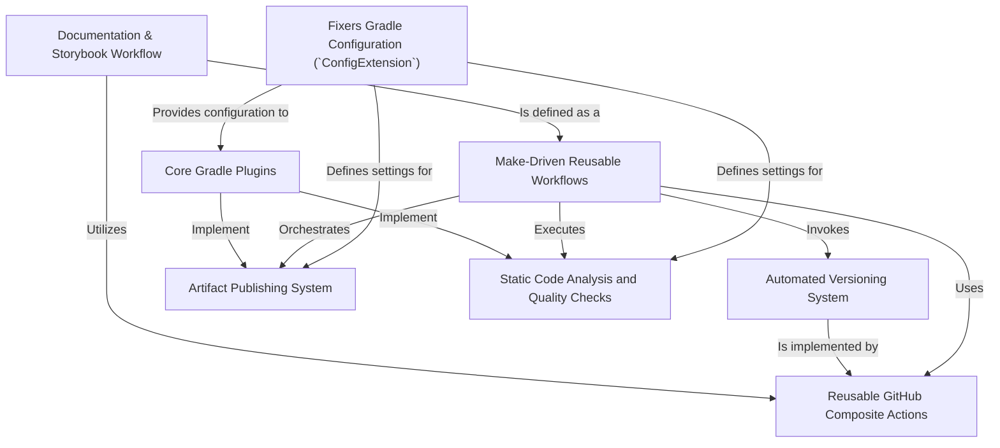

# Tutorial: fixers-gradle

`fixers-gradle` is a toolkit designed to make setting up and managing *Kotlin* projects much easier.
It offers **Gradle plugins** that automatically handle common configurations for building your code,
checking its quality, and publishing it. It also provides **reusable GitHub Actions**
to automate your development workflows, like versioning your software and deploying documentation.
Think of it as a set of helpers that take care of the tedious setup, so you can focus on writing code!

**Source Repository:** [https://github.com/komune-io/fixers-gradle](https://github.com/komune-io/fixers-gradle)

## Chapters

1. [Core Gradle Plugins
](01_core_gradle_plugins_.md)
2. [Fixers Gradle Configuration (`ConfigExtension`)
](02_fixers_gradle_configuration___configextension___.md)
3. [Static Code Analysis and Quality Checks
](03_static_code_analysis_and_quality_checks_.md)
4. [Artifact Publishing System
](04_artifact_publishing_system_.md)
5. [Make-Driven Reusable Workflows
](05_make_driven_reusable_workflows_.md)
6. [Reusable GitHub Composite Actions
](06_reusable_github_composite_actions_.md)
7. [Automated Versioning System
](07_automated_versioning_system_.md)
8. [Documentation & Storybook Workflow
](08_documentation___storybook_workflow_.md)

---

Generated by [AI Codebase Knowledge Builder](https://github.com/The-Pocket/Tutorial-Codebase-Knowledge)