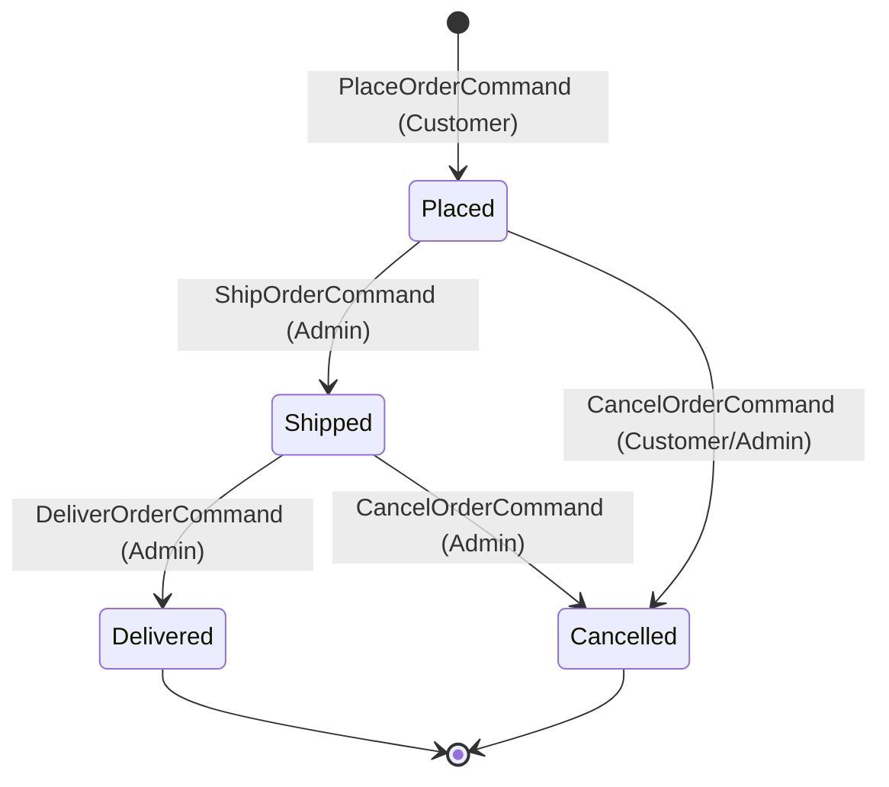
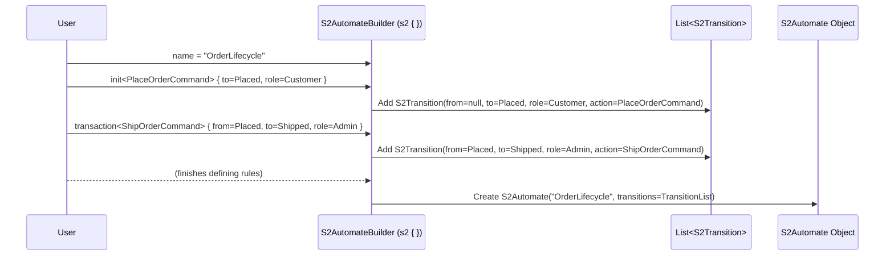

# Chapter 1: S2Automate (Finite State Machine Definition)

Welcome to the S2 framework! This is the very first step in your journey to building robust applications that manage how things change over time. In this chapter, we'll explore the foundational concept of `S2Automate`.

## What's the Big Idea?

Imagine you're building a system to track online orders. An order doesn't just magically appear and then get delivered. It goes through several distinct phases: "Order Placed," "Payment Confirmed," "Order Shipped," and finally, "Order Delivered" (or maybe "Order Cancelled").

How do you ensure an order can only go from "Order Placed" to "Payment Confirmed" if a payment is actually made? Or that an order can't be shipped *before* it's placed?

This is where `S2Automate` comes in. It's like creating a **rulebook** or a **blueprint** for how an object (like our order) or a process can change its state. You define:
1.  All the **possible states** it can be in.
2.  The **commands** (actions) that can trigger a change.
3.  The specific **transitions** (allowed moves) between states.

Think of it like designing a simple board game. You define the spaces on the board (states), what moves a player can make (commands), and the specific rules for moving from one space to another (transitions).

The S2 framework provides a special tool called `S2AutomateBuilder` (and `s2Sourcing` builder for a related pattern we'll discuss later called [Event Sourcing (Architectural Pattern)](06_event_sourcing__architectural_pattern__.md)). This builder uses Kotlin's Domain-Specific Language (DSL) capabilities to make defining these rules clear, concise, and almost like writing them down in plain English.

## Let's Build a Simple Order System Rulebook

Our goal: Define the lifecycle of an online order.

### 1. Defining the States

First, we need to identify all the possible states an order can be in.
For our simple example, let's say an order can be:
*   `Placed`
*   `Shipped`
*   `Delivered`
*   `Cancelled`

In S2, we define these states by creating classes that implement the `S2State` interface. The `position` property helps S2 understand the sequence or order of states, though it's not strictly a flow order, just a unique identifier.

```kotlin
import s2.dsl.automate.S2State
import kotlinx.serialization.Serializable // For making classes easily storable/transferable

// Base class for our Order states
@Serializable // Marks this class for serialization
open class OrderState(override val position: Int) : S2State {
    @Serializable object Placed : OrderState(0)
    @Serializable object Shipped : OrderState(1)
    @Serializable object Delivered : OrderState(2)
    @Serializable object Cancelled : OrderState(3)
}
```
Here, `Placed`, `Shipped`, `Delivered`, and `Cancelled` are specific states our order can be in. Each has a unique `position`.

### 2. Defining Commands (The Triggers)

Next, what actions can cause an order to change its state? These are our "commands."
Let's consider a few:
*   `PlaceOrderCommand`: To create a new order.
*   `ShipOrderCommand`: To ship an order.
*   `DeliverOrderCommand`: To mark an order as delivered.
*   `CancelOrderCommand`: To cancel an order.

We'll dive deeper into [Commands & Events (Interaction Primitives)](02_commands___events__interaction_primitives__.md) in the next chapter. For now, just know that commands are how we tell the system to *do something*.

Here's a sneak peek at how you might define a command (we'll keep it simple):
```kotlin
import s2.dsl.automate.S2InitCommand // For commands that create something
import s2.dsl.automate.S2Command     // For commands that modify something

// A unique identifier for our orders
typealias OrderId = String

// Command to create/initialize an order
data class PlaceOrderCommand(val orderId: OrderId, val items: List<String>) : S2InitCommand

// Command to ship an existing order
data class ShipOrderCommand(override val id: OrderId) : S2Command<OrderId>

// ... (DeliverOrderCommand and CancelOrderCommand would be similar to ShipOrderCommand)
```
*   `PlaceOrderCommand` is special; it's an `S2InitCommand` because it *starts* the lifecycle of an order.
*   `ShipOrderCommand` acts on an existing order, identified by `id`.

### 3. Defining Roles (Who Can Do What?)

Sometimes, you want to restrict who can perform certain actions. For example, maybe only an `Admin` can cancel an order after it's shipped, but a `Customer` can cancel it before shipping. S2 allows you to define `S2Role`s.

```kotlin
import s2.dsl.automate.S2Role
import kotlinx.serialization.Serializable

@Serializable
sealed class OrderRole : S2Role {
    @Serializable object Customer : OrderRole()
    @Serializable object Admin : OrderRole()

    override fun toString(): String = this::class.simpleName!!
}
```
Here, we've defined `Customer` and `Admin` roles.

### 4. Putting It All Together: The `S2Automate` Definition

Now, let's use the `s2` builder (which is an instance of `S2AutomateBuilder`) to define the rules for our order system.

```kotlin
import s2.dsl.automate.builder.s2 // The main builder function

val orderAutomate = s2 {
    name = "OrderLifecycle" // Give your state machine a name

    // Rule for creating an order
    init<PlaceOrderCommand> {
        to = OrderState.Placed // The order starts in the 'Placed' state
        role = OrderRole.Customer // A Customer can place an order
    }

    // Rule for shipping an order
    transaction<ShipOrderCommand> {
        from = OrderState.Placed    // Can only ship if it's 'Placed'
        to = OrderState.Shipped     // Moves to 'Shipped' state
        role = OrderRole.Admin      // An Admin ships the order
    }

    // Add more transactions for DeliverOrderCommand and CancelOrderCommand here...
}
```
Let's break down this `s2` block:
*   `name = "OrderLifecycle"`: Every `S2Automate` needs a name.
*   `init<PlaceOrderCommand> { ... }`: This defines an **initial transition**.
    *   It's triggered by `PlaceOrderCommand`.
    *   It sets the initial state `to = OrderState.Placed`.
    *   It specifies that the `OrderRole.Customer` can perform this action.
    *   `init` transitions don't have a `from` state because they create the entity.
*   `transaction<ShipOrderCommand> { ... }`: This defines a **regular transition**.
    *   It's triggered by `ShipOrderCommand`.
    *   `from = OrderState.Placed`: This rule only applies if the order is currently in the `Placed` state.
    *   `to = OrderState.Shipped`: If the command is successful, the order moves to the `Shipped` state.
    *   `role = OrderRole.Admin`: Only an `Admin` can execute this command.

You would continue to define more `transaction` blocks for other state changes, like:
*   From `Shipped` to `Delivered` using a `DeliverOrderCommand`.
*   From `Placed` or `Shipped` to `Cancelled` using a `CancelOrderCommand`.

Here's how our order lifecycle might look as a diagram:



This `orderAutomate` object is now our complete rulebook! It doesn't *do* anything on its own yet, but it holds all the definitions. In later chapters, we'll see how the [S2AutomateEngine (State Machine Execution Core)](04_s2automateengine__state_machine_execution_core__.md) uses this rulebook to actually manage orders.

## Under the Hood: What Does the Builder Create?

When you use the `s2 { ... }` builder, you're constructing an instance of `S2Automate`. Let's peek at its structure (simplified from `s2-automate/s2-automate-dsl/src/commonMain/kotlin/s2/dsl/automate/S2Automate.kt`):

```kotlin
// Simplified from S2Automate.kt
class S2Automate(
    val name: String,       // e.g., "OrderLifecycle"
    val version: String?,   // Optional version
    val transitions: Array<S2Transition>, // The list of all rules!
) {
    // ... helper methods ...
}
```
The most important part is `transitions: Array<S2Transition>`. Each call to `init` or `transaction` inside the builder adds an `S2Transition` object to this array.

What's an `S2Transition`? (Simplified from `s2-automate/s2-automate-dsl/src/commonMain/kotlin/s2/dsl/automate/S2Transition.kt`)
```kotlin
// Simplified from S2Transition.kt
open class S2Transition(
    open val from: S2StateValue?,   // State before (null for init)
    open val to: S2StateValue,     // State after
    open val role: S2RoleValue,    // Who can do it
    open val action: S2TransitionValue, // The command that triggers it
    open val result: S2TransitionValue?, // The event that results (more next chapter!)
)
```
*   `S2StateValue`, `S2RoleValue`, and `S2TransitionValue` are simple data holders, typically storing the name and (for states) position of your actual State, Role, and Command classes.

So, the builder essentially translates your human-readable DSL into a structured list of these `S2Transition` rules.

Here's a simplified flow of how the builder works:



The `S2AutomateBuilder` (defined in `s2-automate/s2-automate-dsl/src/commonMain/kotlin/s2/dsl/automate/builder/S2AutomateBuilder.kt`) has methods like `init` and `transaction` that take your definitions and create these `S2Transition` objects.

```kotlin
// Simplified from S2AutomateBuilder.kt
class S2AutomateBuilder {
    lateinit var name: String
    val transactions = mutableListOf<S2Transition>() // This list gets populated

    // For 'init' blocks
    inline fun <reified CMD: S2InitCommand> init(exec: S2InitTransitionBuilder.() -> Unit) {
        // ... builder logic ...
        S2Transition(
            from = null, // 'from' is always null for init
            to = builder.to.toValue(), // Converts your State object to S2StateValue
            role = builder.role.toValue(),
            action = CMD::class.toValue(), // Converts your Command class to S2TransitionValue
            // ...
        ).let(transactions::add)
    }

    // For 'transaction' blocks
    inline fun <reified CMD: Cmd> transaction(exec: S2TransitionBuilder.() -> Unit) {
        // ... builder logic ...
        S2Transition(
            from = from.toValue(),
            to = builder.to.toValue(),
            role = builder.role.toValue(),
            action = CMD::class.toValue(),
            // ...
        ).let(transactions::add)
    }
    // ...
}
```
The `.toValue()` extension functions (found in `S2Transition.kt`) are helpers that convert your `S2State`, `S2Role`, and command `KClass` objects into the serializable `S2StateValue`, `S2RoleValue`, and `S2TransitionValue` representations stored within the `S2Transition`.

## Conclusion

You've just learned the very first and most fundamental building block of S2: the `S2Automate` definition. You now know how to:
*   Think about processes in terms of **states**, **commands**, and **transitions**.
*   Define these elements using simple Kotlin classes.
*   Use the `s2` builder (`S2AutomateBuilder`) to create a clear and concise "rulebook" for your system's behavior.

This rulebook, the `S2Automate` object, describes *what can happen* and *under what conditions*.

In the next chapter, we'll take a closer look at the "messages" that drive these state changes: [Commands & Events (Interaction Primitives)](02_commands___events__interaction_primitives__.md). These are the actual triggers and outcomes of the transitions you've just defined.

---

Generated by [AI Codebase Knowledge Builder](https://github.com/The-Pocket/Tutorial-Codebase-Knowledge)