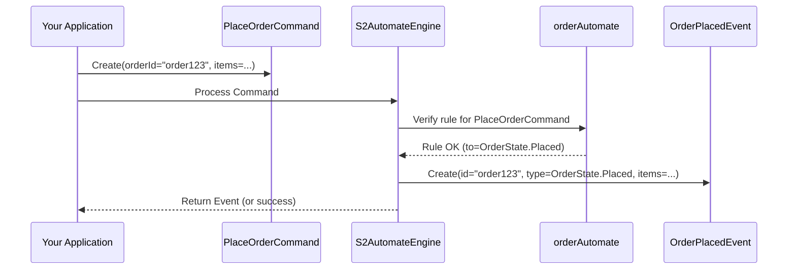

# Chapter 2: Commands & Events (Interaction Primitives)

In [Chapter 1: S2Automate (Finite State Machine Definition)](01_s2automate__finite_state_machine_definition__.md), we learned how to create a "rulebook" or blueprint (`S2Automate`) that defines the possible states an object can be in and how it can transition between them. That's a great start! But how do we actually *tell* our system to make a change? And how does the system tell us *what happened*?

This is where **Commands** and **Events** come into play. They are the fundamental messages we use to interact with our state machine.

## What's the Big Idea? Why Do We Need Commands and Events?

Imagine our online order system again. We've defined that an order can go from `Placed` to `Shipped`.
*   How do we actually *instruct* the system to "Ship this specific order"? That's a **Command**.
*   Once the system processes this instruction and the order is successfully shipped, how do we get a confirmation or a record that "This order has now been shipped"? That's an **Event**.

Commands are like **requests** or **instructions** you give to the system. "Please do this!"
Events are like **notifications** or **records of facts**. "This has happened!"

This separation is a core idea from a pattern called **Command Query Responsibility Segregation (CQRS)**. Don't worry too much about the fancy name yet! The main takeaway is:
*   **Commands** are for *changing* state.
*   **Events** are for *recording* that state has changed. (And "Queries" are for reading state, which Events help enable).

This makes our system:
*   **Clearer**: It's obvious what action is intended versus what outcome occurred.
*   **More Robust**: We can handle requests and their outcomes separately.
*   **Auditable**: Events provide a history of what happened, which is great for tracking and debugging.

## S2Commands: Telling the System What to Do

An `S2Command` is a message that represents an intent to change the state of an entity (like our order).

There are two main types of commands in S2:

1.  **`S2InitCommand`**: Used when you want to *create* a new entity. Our `PlaceOrderCommand` from Chapter 1 is a perfect example. It doesn't act on an existing order; it initiates a new one.
2.  **`S2Command<ID>`**: Used for any action on an *existing* entity. It needs to know which entity to act upon, so it always includes an `id` (like an `orderId`). Our `ShipOrderCommand` would be this type.

Let's look at how we define them in Kotlin.

### Defining an `S2InitCommand` (Creating an Order)

In Chapter 1, we had a sneak peek. Let's formalize it.
To create an order, we might need the order ID and the items.

```kotlin
import s2.dsl.automate.S2InitCommand
import kotlinx.serialization.Serializable // For making it transferable

typealias OrderId = String // A unique identifier for our orders

@Serializable // Makes it easy to send this command around
data class PlaceOrderCommand(
    val orderId: OrderId,
    val items: List<String>
) : S2InitCommand
```
*   `PlaceOrderCommand` *is an* `S2InitCommand`. This tells S2 it's for creating something new.
*   It carries data: `orderId` and `items`.
*   It's a `data class`, which is convenient in Kotlin for classes that primarily hold data.

### Defining an `S2Command<ID>` (Shipping an Order)

To ship an existing order, we need to know *which* order to ship.

```kotlin
import s2.dsl.automate.S2Command
import kotlinx.serialization.Serializable

@Serializable
data class ShipOrderCommand(
    override val id: OrderId // The ID of the order to ship
    // You could add other data if needed, e.g., shippingAddress
) : S2Command<OrderId>
```
*   `ShipOrderCommand` *is an* `S2Command<OrderId>`. This tells S2 it acts on an existing entity identified by an `OrderId`.
*   It *must* have an `id` property. The `override val id: OrderId` fulfills this.

When you defined transitions in your `S2Automate` in Chapter 1, the type you put in `init<PlaceOrderCommand>` or `transaction<ShipOrderCommand>` was exactly these command classes!

```kotlin
// Reminder from Chapter 1
val orderAutomate = s2.dsl.automate.builder.s2 {
    name = "OrderLifecycle"
    init<PlaceOrderCommand> { /* ... */ }      // Uses S2InitCommand
    transaction<ShipOrderCommand> { /* ... */ } // Uses S2Command
    // ...
}
```

## S2Events: Recording What Happened

An `S2Event` is a message that represents something that *has already occurred* as a result of a command. It's a statement of fact.

Events are crucial because they:
1.  Confirm that a command was processed.
2.  Indicate the new state of the entity.
3.  Provide a historical record (which is super useful for [Event Sourcing (Architectural Pattern)](06_event_sourcing__architectural_pattern__.md), a topic for a later chapter!).

Every `S2Event` typically carries:
*   The `id` of the entity that was affected.
*   The `type` which represents the new `S2State` the entity is in.

Let's define events corresponding to our commands.

### Defining an Event for Order Creation

When a `PlaceOrderCommand` is successfully processed, an `OrderPlacedEvent` might be generated.

```kotlin
import s2.dsl.automate.S2Event
import kotlinx.serialization.Serializable
// Assuming OrderState is defined as in Chapter 1
// import com.example.OrderState

@Serializable
data class OrderPlacedEvent(
    override val id: OrderId, // The ID of the order that was created
    override val type: OrderState.Placed, // The new state of the order
    val items: List<String> // You can include other relevant data
) : S2Event<OrderState, OrderId>
```
*   `OrderPlacedEvent` *is an* `S2Event<OrderState, OrderId>`.
    *   `OrderState` tells S2 what kind of state this event relates to.
    *   `OrderId` tells S2 the type of the ID.
*   It has an `id` (the ID of the newly created order).
*   It has a `type` property, which *must* be an `S2State`. Here, it's `OrderState.Placed`, indicating the order is now in the "Placed" state.
*   It can carry other data from the command or resulting from the process, like `items`.

### Defining an Event for Order Shipping

When a `ShipOrderCommand` is successful, an `OrderShippedEvent` could be generated.

```kotlin
import s2.dsl.automate.S2Event
import kotlinx.serialization.Serializable
// Assuming OrderState is defined as in Chapter 1

@Serializable
data class OrderShippedEvent(
    override val id: OrderId, // The ID of the shipped order
    override val type: OrderState.Shipped // The new state: Shipped
    // You could add shippingDate, trackingNumber, etc.
) : S2Event<OrderState, OrderId>
```
*   Similar to `OrderPlacedEvent`, it implements `S2Event<OrderState, OrderId>`.
*   The `type` here is `OrderState.Shipped`, reflecting the new state.

In our `S2Automate` definition from Chapter 1, each transition rule implicitly leads to an event. The `S2Transition` object actually has a `result` field, which would point to the type of event generated (like `OrderPlacedEvent::class`).

```kotlin
// Simplified from S2Transition.kt (as seen in Chapter 1)
// open val result: S2TransitionValue?, // The event that results!
```
This means for every `init` or `transaction` you define, the system expects a corresponding event to signify its completion.

## How Commands and Events Work Together (A Sneak Peek)

You, or another part of your system, will create and send a **Command** object. For example, to place an order:
```kotlin
val command = PlaceOrderCommand(orderId = "order123", items = listOf("S2 Book", "Coffee Mug"))
// This command is then sent to the S2 system (more on this in Chapter 4)
```

The S2 system (specifically, the [S2AutomateEngine (State Machine Execution Core)](04_s2automateengine__state_machine_execution_core__.md), which we'll cover later) will:
1.  Receive the `PlaceOrderCommand`.
2.  Look at your `orderAutomate` definition.
3.  Find the `init<PlaceOrderCommand>` rule.
4.  Check if the command is allowed (e.g., based on role, and later, [Guards (Transition Pre-conditions)](03_guards__transition_pre_conditions__.md)).
5.  If everything is okay, it processes the command.
6.  As a result, it generates an **Event**, for example:
    ```kotlin
    // The system would generate something like this:
    val event = OrderPlacedEvent(
        id = "order123",
        type = OrderState.Placed, // The order is now in Placed state
        items = listOf("S2 Book", "Coffee Mug")
    )
    // This event is then stored and/or published.
    ```

Here's a simplified flow:



## Under the Hood: What Do `S2Command` and `S2Event` Look Like?

The interfaces for `S2Command` and `S2Event` are actually quite straightforward. They are defined in the S2 library.

From `s2-automate/s2-automate-dsl/src/commonMain/kotlin/s2/dsl/automate/S2Command.kt`:
```kotlin
// Simplified S2InitCommand interface
interface S2InitCommand : Cmd // Cmd is just a generic Command marker

// Simplified S2Command interface
interface S2Command<ID> : Cmd, WithId<ID> {
    override val id: ID & Any // Requires an 'id' property
}
```
*   `S2InitCommand` just needs to be a `Cmd` (a general command marker from `f2.dsl.cqrs.Message`).
*   `S2Command<ID>` also needs to be a `Cmd` and implement `WithId<ID>`, which simply means it must have an `id` property of type `ID`.

From `s2-automate/s2-automate-dsl/src/commonMain/kotlin/s2/dsl/automate/S2Event.kt`:
```kotlin
// Simplified S2Event interface
interface S2Event<out STATE : S2State, ID> : Evt, WithId<ID> {
    override val id: ID        // Requires an 'id' property
    val type: STATE           // Requires a 'type' property holding the new state
}
```
*   `S2Event<STATE, ID>` needs to be an `Evt` (a general event marker from `f2.dsl.cqrs.Message`), implement `WithId<ID>`, and also have a `type` property that holds the `S2State` the entity transitioned to.

The `Cmd` and `Evt` types are themselves simple type aliases from `s2-automate/s2-automate-dsl/src/commonMain/kotlin/s2/dsl/automate/Msg.kt`:
```kotlin
// From Msg.kt
typealias Cmd = f2.dsl.cqrs.Command
typealias Evt = f2.dsl.cqrs.Event
```
These `f2.dsl.cqrs.Command` and `f2.dsl.cqrs.Event` are base interfaces from a related library, providing a common foundation for messages.

So, when you create your `PlaceOrderCommand` or `OrderPlacedEvent`, you are simply creating data classes that fulfill these simple interface contracts!

You can see real-world examples in the provided samples:
*   For `DidS2` state machine (from `README.md`):
    *   `DidCreateCommand` (an `S2InitCommand`) and `DidCreatedEvent` (an `S2Event`) are used for initializing a DID.
    *   `DidAddPublicKeyCommand` (an `S2Command`) and `DidAddPublicKeyEvent` (an `S2Event`) are used for modifying an existing DID. (See `sample/did-sample/did-domain/src/commonMain/kotlin/s2/sample/did/domain/features/DidAddPublicKeyFunction.kt`)
*   For `OrderBookSourcing` (from `sample/orderbook-sourcing/orderbook-sourcing-domain/src/commonMain/kotlin/s2/sample/subautomate/domain/orderBook/OrderBookCommand.kt`):
    *   `OrderBookCreateCommand` is an `S2InitCommand`.
    *   `OrderBookCreatedEvent` is its corresponding event.
    *   `OrderBookUpdateCommand` is an `S2Command`.
    *   `OrderBookUpdatedEvent` is its corresponding event.

## Conclusion

You've now learned about the two fundamental types of messages in S2:
*   **`S2Command`s**: These are your **requests** to the system to do something, like create an order (`S2InitCommand`) or ship an existing order (`S2Command`). They express *intent* to change state.
*   **`S2Event`s**: These are **notifications** or **facts** that record what happened as a result of a command, like an order being placed or shipped. They signify that a state change *has occurred* and capture the new state.

These interaction primitives are essential for telling your state machine what to do and for understanding its responses. They form the backbone of communication with your S2-managed entities.

In the next chapter, we'll explore [Guards (Transition Pre-conditions)](03_guards__transition_pre_conditions__.md). Guards allow us to add more sophisticated rules to our transitions, deciding *if* a command can actually proceed based on more than just the current state.

---

Generated by [AI Codebase Knowledge Builder](https://github.com/The-Pocket/Tutorial-Codebase-Knowledge)