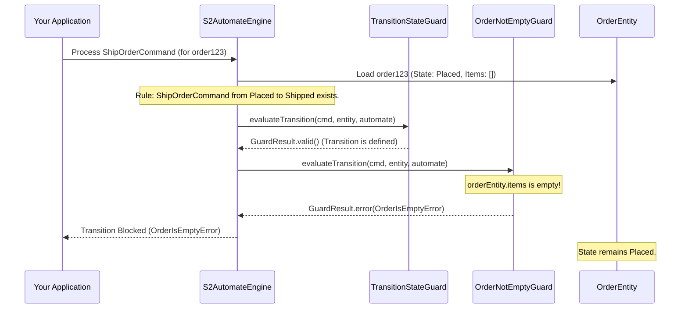

# Chapter 3: Guards (Transition Pre-conditions)

In the [previous chapter, Commands & Events (Interaction Primitives)](02_commands___events__interaction_primitives__.md), we learned how to send instructions (Commands) to our state machine and how it reports back what happened (Events). This is great for defining *what* actions can be taken and *what* state changes result.

But what if we need more detailed checks before allowing a state change? For example, in our online order system:
*   Can an order be shipped if it has no items? Probably not!
*   Can a customer cancel an order after it's already been shipped? Maybe only an admin can do that.

Simply checking the current state (`from` state in a transition) and the user's role isn't always enough. We need finer-grained control. This is where **Guards** come in!

## What's the Big Idea? Guards as Bouncers!

Imagine a state transition as trying to enter an exclusive club.
*   The **Command** is you saying, "I want to enter!"
*   The **`S2Automate` definition** checks if you're at the right door (current state) and if you're on the guest list for this type of entry (command type).
*   A **Guard** is like the bouncer at the door. Even if you're at the right door and on the list, the bouncer might have additional checks:
    *   "Is your ID valid?" (e.g., Is the data in the command correct?)
    *   "Are you dressed appropriately?" (e.g., Does the order meet certain business rules?)
    *   "Is the club full?" (e.g., Are system resources available?)

If you pass all the bouncer's checks (the Guard's conditions are met), you're allowed in (the transition proceeds). If not, you're politely (or not so politely!) turned away (the transition is blocked).

Guards are essentially **pre-conditions** that must be satisfied *before* a state transition can occur. They help ensure the integrity of your system and enforce complex business rules.

## How Do Guards Work in S2?

When the S2 system receives a command to change the state of an entity:
1.  It first checks the basic transition rules defined in your `S2Automate` (like we saw in Chapter 1).
2.  Then, **before** actually changing the state, it consults any registered Guards associated with that transition.
3.  Each Guard evaluates its specific condition(s).
4.  If *all* Guards say "Okay!" (their conditions are met), the transition proceeds, and an event is generated.
5.  If *any* Guard says "Nope!" (a condition is not met), the transition is blocked, and an error is typically returned. The state does not change.

This ensures that your system only moves to a new state when all necessary conditions are true.

## A Common Guard: `TransitionStateGuard`

One very common and often automatically included guard is the `TransitionStateGuard`.
Remember in [Chapter 1: S2Automate (Finite State Machine Definition)](01_s2automate__finite_state_machine_definition__.md), we defined transitions like:
```kotlin
// From Chapter 1's S2Automate definition
transaction<ShipOrderCommand> {
    from = OrderState.Placed
    to = OrderState.Shipped
    role = OrderRole.Admin
}
```
This says a `ShipOrderCommand` can move an order from `Placed` to `Shipped`.

The `TransitionStateGuard` is responsible for this fundamental check: **"Is there even a transition defined in my `S2Automate` rulebook that allows this `ShipOrderCommand` when the order is in `OrderState.Placed`?"**

If you try to send a `ShipOrderCommand` for an order that is, say, already `Delivered`, the `TransitionStateGuard` would step in and say, "Hold on! My rulebook (`S2Automate`) doesn't have a rule for shipping an already delivered order." The transition would be blocked.

This guard ensures that the state machine only follows paths you've explicitly defined.

## Creating Your Own Custom Guard

Let's make our order system more robust. We want to ensure an order cannot be shipped if it has no items.

**1. Imagine our Order Entity**

First, let's assume our `OrderEntity` (the actual data object representing an order) stores a list of items. We haven't formally defined entities yet, but for this example, imagine it has an `items` property:
```kotlin
// A simplified idea of what our OrderEntity might look like
// (WithS2Id and WithS2State are helper interfaces)
data class OrderEntity(
    override val s2Id: OrderId,         // From Chapter 2
    override var s2State: OrderState,   // From Chapter 1
    val items: List<String>             // The items in the order
) : WithS2Id<OrderId>, WithS2State<OrderState>
```

**2. The `Guard` Interface**

To create a custom guard, we need to implement the `Guard` interface (or extend `GuardAdapter` for convenience). A simplified view of `Guard` from `s2-automate/s2-automate-core/src/commonMain/kotlin/s2/automate/core/guard/Guard.kt` looks like this:

```kotlin
// Simplified Guard interface
interface Guard<STATE, ID, ENTITY, ...> {
    // Checks conditions BEFORE an S2InitCommand
    suspend fun evaluateInit(...): GuardResult

    // Checks conditions BEFORE an S2Command
    suspend fun evaluateTransition(...): GuardResult

    // ... (other methods for checks AFTER transition)
}
```
For our "don't ship empty order" rule, we're interested in `evaluateTransition`, which is called before a regular state transition (like shipping an existing order). It needs to return a `GuardResult`.

**3. The `GuardResult`**

A `GuardResult` tells the system if the guard's condition passed or failed. From `s2-automate/s2-automate-core/src/commonMain/kotlin/s2/automate/core/guard/GuardResult.kt`:
```kotlin
// Simplified GuardResult
interface GuardResult {
    val errors: List<S2Error> // List of errors if any
    fun isValid(): Boolean    // True if no errors

    companion object {
        fun valid(): GuardResult         // Creates a success result
        fun error(...): GuardResult // Creates a failure result
    }
}
```
If `isValid()` is true, the check passes. If false, it fails, and the `errors` list can provide details.

**4. Implementing Our `OrderNotEmptyGuard`**

Let's create a guard that prevents shipping an order if its `items` list is empty. We'll extend `GuardAdapter` which provides default "valid" implementations for all `Guard` methods, so we only need to override the one we care about.

```kotlin
import s2.automate.core.guard.GuardAdapter
import s2.automate.core.guard.GuardResult
import s2.automate.core.context.TransitionContext
import s2.dsl.automate.S2Error // For defining custom errors

// Define a custom error for our guard
data class OrderIsEmptyError(val orderId: OrderId) : S2Error(
    type = "OrderIsEmpty",
    description = "Cannot process order $orderId because it has no items.",
    date = kotlinx.datetime.Clock.System.now().toString(), // Current time
    payload = mapOf("orderId" to orderId)
)

// Our custom guard
class OrderNotEmptyGuard : GuardAdapter<OrderState, OrderId, OrderEntity, Any, Any>() { // Types match our Order system

    override suspend fun <COMMAND: s2.dsl.automate.Cmd> evaluateTransition(
        context: TransitionContext<OrderState, OrderId, OrderEntity, Any, COMMAND>
    ): GuardResult {
        // We only care about the ShipOrderCommand
        if (context.command.data is ShipOrderCommand) { // command.data is the actual command object
            val orderEntity = context.entity // The current state of the order
            if (orderEntity.items.isEmpty()) {
                // Order is empty, block the transition!
                return GuardResult.error(OrderIsEmptyError(orderEntity.s2Id))
            }
        }
        // For other commands, or if items are not empty, it's valid.
        return GuardResult.valid()
    }
}
```
Let's break this down:
*   `OrderNotEmptyGuard` extends `GuardAdapter` with types relevant to our order system (`OrderState`, `OrderId`, `OrderEntity`).
*   We override `evaluateTransition`. This function gets a `TransitionContext` which contains:
    *   `context.command`: The command being processed (e.g., `ShipOrderCommand`).
    *   `context.entity`: The current state of the entity (our `OrderEntity`).
    *   `context.automateContext.automate`: The `S2Automate` definition.
*   We check if the command is a `ShipOrderCommand`.
*   If it is, we access `context.entity.items`.
*   If `items` is empty, we return `GuardResult.error()` with our custom `OrderIsEmptyError`. This tells S2 to stop the transition.
*   Otherwise (or for other commands), we return `GuardResult.valid()`.

**5. How Guards are Used (A Glimpse)**

You would typically register your custom guards (like `OrderNotEmptyGuard`) with the [S2AutomateEngine (State Machine Execution Core)](04_s2automateengine__state_machine_execution_core__.md) (more on that in the next chapter!). The engine then ensures they are called at the right time.

When a `ShipOrderCommand` arrives:
1.  The engine might first check the `TransitionStateGuard` (is shipping allowed from the current state?).
2.  If that passes, it would then call our `OrderNotEmptyGuard.evaluateTransition()`.
3.  If `OrderNotEmptyGuard` returns `valid()`, the order is shipped.
4.  If it returns an `error()`, the shipping is blocked, and the error (e.g., `OrderIsEmptyError`) is reported.

## Under the Hood: How the System Manages Guards

Let's peek at what happens when a command triggers a transition that has guards.

**Simplified Flow:**


In this case, because `OrderNotEmptyGuard` found an issue (empty items), the transition to `Shipped` was prevented.

**Key Components Involved:**

*   **`Guard.kt`**: The core interface all guards implement.
    ```kotlin
    // From: s2-automate/s2-automate-core/src/commonMain/kotlin/s2/automate/core/guard/Guard.kt
    interface Guard<STATE, ID, ENTITY, EVENT, AUTOMATE> where /* type constraints */ {
        suspend fun evaluateInit(context: InitTransitionContext<AUTOMATE>): GuardResult
        suspend fun <COMMAND: Cmd> evaluateTransition(
            context: TransitionContext<STATE, ID, ENTITY, AUTOMATE, COMMAND>
        ): GuardResult
        // ... other verification methods ...
    }
    ```
    This defines the contract for evaluating conditions before (`evaluate...`) and potentially after (`verify...`) transitions.

*   **`GuardAdapter.kt`**: A convenience class.
    ```kotlin
    // From: s2-automate/s2-automate-core/src/commonMain/kotlin/s2/automate/core/guard/GuardAdapter.kt
    open class GuardAdapter<...> : Guard<...> {
        override suspend fun evaluateInit(...) = GuardResult.valid()
        override suspend fun <COMMAND: Cmd> evaluateTransition(...) = GuardResult.valid()
        // ... default valid results for all methods ...
    }
    ```
    It provides default implementations that return `GuardResult.valid()`, making it easy to create a guard by only overriding the methods you need.

*   **`GuardResult.kt`**: As we saw, this represents the outcome of a guard's evaluation.
    ```kotlin
    // From: s2-automate/s2-automate-core/src/commonMain/kotlin/s2/automate/core/guard/GuardResult.kt
    interface GuardResult {
        companion object {
            fun valid(): GuardResult
            fun error(vararg errors: S2Error): GuardResult
            // ...
        }
        val errors: List<S2Error>
        fun isValid(): Boolean
    }
    ```

*   **`GuardVerifierImpl.kt`**: This is an internal S2 component (part of the engine) that takes a list of guards and executes them.
    ```kotlin
    // From: s2-automate/s2-automate-core/src/commonMain/kotlin/s2/automate/core/guard/GuardVerifierImpl.kt
    // Simplified concept:
    class GuardVerifierImpl(
        private val guards: List<Guard<...>>, /* ... */
    ) {
        suspend fun evaluateTransition(context: TransitionContext<...>) {
            val results = guards.map { it.evaluateTransition(context) }
            val allErrors = results.flatMap { it.errors }
            if (allErrors.isNotEmpty()) {
                // If any guard returned errors, publish an event and throw an exception
                // publisher.automateTransitionNotAccepted(...)
                throw AutomateException(allErrors)
            }
        }
        // ... similar logic for evaluateInit, verifyInitTransition, verifyTransition ...
    }
    ```
    The `GuardVerifierImpl` iterates through all registered guards. If any guard returns a result with errors, it collects these errors and throws an `AutomateException`, effectively stopping the transition process.

*   **`TransitionStateGuard.kt`**: Let's look at how this specific guard works.
    ```kotlin
    // From: s2-automate/s2-automate-core/src/commonMain/kotlin/s2/automate/core/guard/TransitionStateGuard.kt
    class TransitionStateGuard<...> : GuardAdapter<...>() {
        override suspend fun <COMMAND : Cmd> evaluateTransition(
            context: TransitionContext<...>
        ): GuardResult {
            val state = context.entity.s2State() // Get current entity state
            val cmd = context.command.data       // Get the actual command
            // Ask the S2Automate definition if this transition is allowed
            val isCmdValid = context.automateContext.automate.isAvailableTransition(state, cmd)
            return if (isCmdValid) {
                GuardResult.valid()
            } else {
                GuardResult.error( /* ERROR_INVALID_TRANSITION */ )
            }
        }
    }
    ```
    It simply gets the current state of the entity and the command being processed. Then, it asks the `S2Automate` definition (which is available in `context.automateContext.automate`) if a transition is defined for that state and command. If `isAvailableTransition` returns `false`, it means the rulebook doesn't allow it, so the guard returns an error.

## Conclusion

You've now learned about Guards, the powerful "bouncers" for your state transitions!
*   **Guards enforce pre-conditions** before a state change can occur.
*   They ensure **data integrity** and allow you to implement **complex business rules**.
*   The `TransitionStateGuard` is a fundamental guard checking if a transition is even defined in your `S2Automate` rulebook.
*   You can easily create **custom Guards** by implementing the `Guard` interface (or extending `GuardAdapter`) to add your own specific checks, like our `OrderNotEmptyGuard`.
*   Guards return a `GuardResult` to indicate success (`valid()`) or failure (`error()`).

Guards are a critical tool for building robust and reliable state machines. They give you fine-grained control over when and how state changes happen.

In the next chapter, we'll dive into the [S2AutomateEngine (State Machine Execution Core)](04_s2automateengine__state_machine_execution_core__.md). This is the heart of the S2 system that takes your `S2Automate` definitions, Commands, and Guards, and actually orchestrates the state transitions!

---

Generated by [AI Codebase Knowledge Builder](https://github.com/The-Pocket/Tutorial-Codebase-Knowledge)