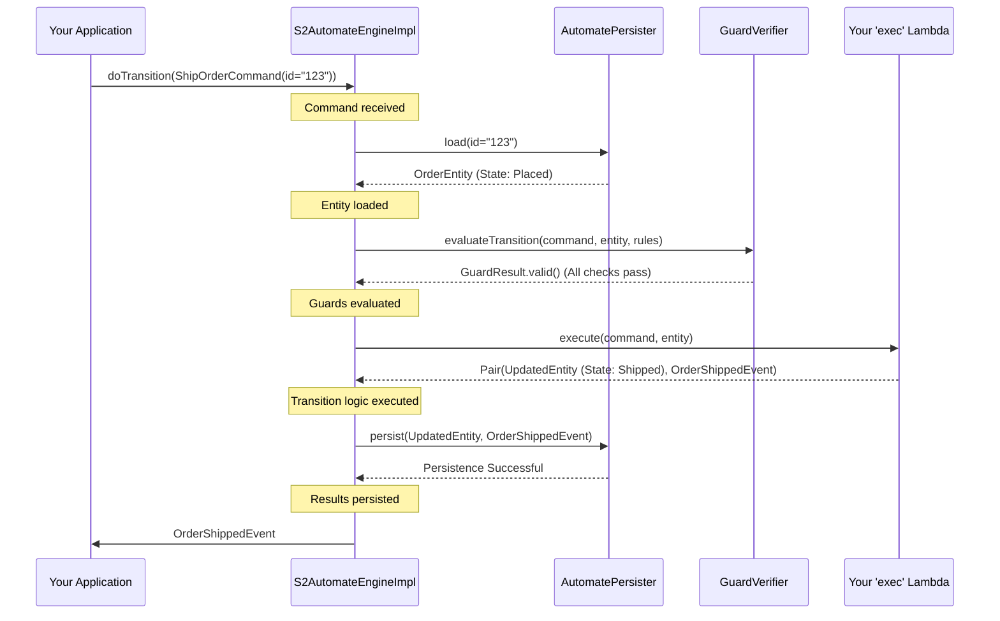

# Chapter 4: S2AutomateEngine (State Machine Execution Core)

In [Chapter 3: Guards (Transition Pre-conditions)](03_guards__transition_pre_conditions__.md), we learned how Guards act like bouncers, adding extra checks before a state transition is allowed. We now have our rulebook (`S2Automate`), our messages (Commands and Events), and our bouncers (Guards). But who actually takes a command, checks with the bouncers, consults the rulebook, and then makes the change happen?

Meet the **`S2AutomateEngine`**! This is the heart of our state machine, the component that does the actual work of processing commands and driving state changes.

## What's the Big Idea? The Engine Driving Your State Machine

Imagine building a car:
*   Your `S2Automate` definition (from [Chapter 1](01_s2automate__finite_state_machine_definition__.md)) is like the car's design blueprint – it says how the car *should* operate (e.g., gear shifts).
*   [Commands](02_commands___events__interaction_primitives__.md) are like you pressing the gas pedal or turning the steering wheel – your instructions.
*   [Guards](03_guards__transition_pre_conditions__.md) are like safety checks – is there enough fuel? Are the doors closed?
*   The **`S2AutomateEngine` is the actual engine of the car**. It takes your input (pressing the gas), checks if it's safe and allowed (guards), follows the car's design (blueprint), and then makes the wheels turn (changes state).

The `S2AutomateEngine` is the central processing unit for your state machine. It:
1.  Receives an incoming [Command](02_commands___events__interaction_primitives__.md).
2.  (For existing entities) Loads the current state of the entity.
3.  Checks if the command is valid according to the `S2Automate` rules and any registered [Guards](03_guards__transition_pre_conditions__.md).
4.  If everything is okay, it executes the logic to transition to a new state.
5.  It then triggers the persistence of the new state or the resulting [Event](02_commands___events__interaction_primitives__.md).
6.  Finally, it often returns the Event that occurred.

It's the "game master" or "referee" that ensures all rules are followed and the game (your state machine) progresses correctly.

**Our Use Case:** Let's say we want to process a `PlaceOrderCommand` for our online order system.
*   **Input:** `PlaceOrderCommand(orderId = "order456", items = ["S2 Guidebook"])`
*   **Action:** The `S2AutomateEngine` needs to take this command, verify it, create a new order entity in the `Placed` state, and generate an `OrderPlacedEvent`.
*   **Output (conceptually):** `OrderPlacedEvent(id = "order456", type = OrderState.Placed, items = ["S2 Guidebook"])`

## How the Engine Works: A Simplified Flow

Let's trace what the `S2AutomateEngine` does when it receives a command, for example, a `ShipOrderCommand`.

1.  **Receive Command:** The engine gets a `ShipOrderCommand(id = "order123")`.
2.  **Load Entity:** It asks the [AutomatePersister (Persistence Layer)](05_automatepersister__persistence_layer__.md) (which we'll cover next) to load the current `OrderEntity` with ID "order123". Let's say it's currently in `OrderState.Placed`.
3.  **Consult Rulebook & Guards:**
    *   It checks your `S2Automate` definition: "Is there a transition for `ShipOrderCommand` from `OrderState.Placed`?" (This is often done by a built-in Guard like `TransitionStateGuard`).
    *   It then runs any other [Guards](03_guards__transition_pre_conditions__.md) you've defined (e.g., our `OrderNotEmptyGuard` from Chapter 3).
4.  **Execute Transition Logic:** If all checks pass, the engine needs to know *how* to actually change the order and what event to create. You provide this logic, typically as a small piece of code (a lambda function). This code will:
    *   Take the current `OrderEntity` and the `ShipOrderCommand`.
    *   Create a new version of the `OrderEntity` with its state updated to `OrderState.Shipped`.
    *   Create an `OrderShippedEvent`.
5.  **Persist Results:** The engine tells the [AutomatePersister (Persistence Layer)](05_automatepersister__persistence_layer__.md) to save the new state of the `OrderEntity` and/or the `OrderShippedEvent`.
6.  **Return Event:** The engine returns the `OrderShippedEvent` as confirmation.

If any guard fails, the engine stops the process and usually reports an error. No state change occurs.

## Interacting with the `S2AutomateEngine`

While in larger applications (especially those using Spring, as we'll see in [Spring Integration Adapters](08_spring_integration_adapters_.md)), you might interact with the engine through wrapper classes, understanding its core interface is key.

The `S2AutomateEngine` interface (simplified from `s2-automate/s2-automate-core/src/commonMain/kotlin/s2/automate/core/engine/S2AutomateEngine.kt`) has two main methods:

*   `create()`: For handling `S2InitCommand`s (when you're creating a new entity).
*   `doTransition()`: For handling `S2Command`s (when you're acting on an existing entity).

Let's look at a conceptual example of how you might use `create()`:

```kotlin
// Assume 'engine' is an instance of S2AutomateEngine
// Assume PlaceOrderCommand, OrderEntity, OrderPlacedEvent, OrderState are defined

val placeOrderCmd = PlaceOrderCommand(orderId = "order456", items = listOf("S2 Guidebook"))

// We send commands as a Flow (even if it's just one)
val commandsFlow = kotlinx.coroutines.flow.flowOf(
    f2.dsl.cqrs.envelope.Envelope(placeOrderCmd) // Commands are often wrapped in Envelopes
)

// The 'decide' lambda tells the engine HOW to create the entity and event
val eventsFlow = engine.create(commandsFlow) { envelopedCmd ->
    val cmdData = envelopedCmd.data // Get the actual PlaceOrderCommand
    val newOrder = OrderEntity(
        s2Id = cmdData.orderId,
        s2State = OrderState.Placed, // Set initial state
        items = cmdData.items
    )
    val event = OrderPlacedEvent(
        id = cmdData.orderId,
        type = OrderState.Placed, // Event reflects the new state
        items = cmdData.items
    )
    Pair(newOrder, f2.dsl.cqrs.envelope.Envelope(event)) // Return new entity and event (also enveloped)
}

// eventsFlow would then emit the OrderPlacedEvent (or an error)
```
In this conceptual snippet:
*   We create a `PlaceOrderCommand`.
*   The `engine.create()` method takes a flow of commands.
*   The crucial part is the lambda function you provide: ` { envelopedCmd -> ... } `. This is often called the `decide` block.
    *   It receives the command.
    *   You write the logic to create the new `OrderEntity` in its initial state (`OrderState.Placed`).
    *   You create the corresponding `OrderPlacedEvent`.
    *   You return a `Pair` of the new entity and the event.
*   The engine handles calling guards, persisting, etc., around your `decide` block.

Similarly, for `doTransition()` to handle something like a `ShipOrderCommand`:

```kotlin
// Assume 'engine', ShipOrderCommand, OrderEntity, OrderShippedEvent, OrderState are defined

val shipOrderCmd = ShipOrderCommand(id = "order123")
val commandsFlow = kotlinx.coroutines.flow.flowOf(
    f2.dsl.cqrs.envelope.Envelope(shipOrderCmd)
)

// The 'exec' lambda tells the engine HOW to update the entity and create the event
val eventsFlow = engine.doTransition(commandsFlow) { envelopedCmd, currentOrderEntity ->
    val cmdData = envelopedCmd.data // The ShipOrderCommand
    // 'currentOrderEntity' is loaded by the engine and passed to you
    val updatedOrder = currentOrderEntity.copy(s2State = OrderState.Shipped)
    val event = OrderShippedEvent(
        id = cmdData.id,
        type = OrderState.Shipped
    )
    Pair(updatedOrder, f2.dsl.cqrs.envelope.Envelope(event)) // Return updated entity and event
}
```
Here, the lambda is often called `exec`. It receives the command *and* the current `OrderEntity` (which the engine loaded for you). You then define how to create the updated entity and the resulting event.

The beauty is that your `decide` or `exec` logic focuses purely on the business transformation, while the engine takes care of the surrounding orchestration (loading, guards, saving).

## Under the Hood: What's Inside the Engine?

Let's peek at the internal workings of the `S2AutomateEngine`.

### Simplified Sequence of Operations (for `doTransition`)

Here's what happens when the engine processes a command for an existing entity:


This diagram shows the engine coordinating with the persister, guards, and your custom logic.

### Key Code Components

1.  **`S2AutomateEngine.kt` (Interface)**
    This file defines the contract for any S2 engine.
    Located at: `s2-automate/s2-automate-core/src/commonMain/kotlin/s2/automate/core/engine/S2AutomateEngine.kt`

    ```kotlin
    // Simplified from S2AutomateEngine.kt
    interface S2AutomateEngine<STATE, ENTITY, ID, EVENT> where /* type constraints */ {
        suspend fun <COMMAND: S2InitCommand, ...> create(
            commands: EnvelopedFlow<COMMAND>,
            decide: suspend (cmd: Envelope<COMMAND>) -> Pair<ENTITY_OUT, Envelope<EVENT_OUT>>
        ): EnvelopedFlow<EVENT_OUT>

        suspend fun <COMMAND: S2Command<ID>, ...> doTransition(
            commands: EnvelopedFlow<COMMAND>,
            exec: suspend (Envelope<out COMMAND>, ENTITY) -> Pair<ENTITY_OUT, Envelope<EVENT_OUT>>
        ): EnvelopedFlow<EVENT_OUT>
    }
    ```
    *   `STATE`, `ENTITY`, `ID`, `EVENT` are generic types for your specific state, entity, ID, and event classes.
    *   `EnvelopedFlow` means it works with Kotlin Flows of commands/events, often wrapped in an `Envelope` that can carry metadata.
    *   The `decide` and `exec` parameters are the lambdas where you plug in your business logic.

2.  **`S2AutomateEngineImpl.kt` (Default Implementation)**
    This is the standard implementation of the engine.
    Located at: `s2-automate/s2-automate-core/src/commonMain/kotlin/s2/automate/core/engine/S2AutomateEngineImpl.kt`

    It's constructed with several key dependencies:
    ```kotlin
    // Simplified constructor from S2AutomateEngineImpl.kt
    class S2AutomateEngineImpl<STATE, ID, ENTITY, EVENT>(
        private val automateContext: AutomateContext<S2Automate>, // Has S2Automate rules
        private val guardExecutor: GuardVerifier<...>,           // Executes Guards
        private val persister: AutomatePersister<...>,           // Handles saving/loading
        private val publisher: AutomateEventPublisher<...>       // Publishes internal app events
    ) : S2AutomateEngine<STATE, ENTITY, ID, EVENT> { /* ... */ }
    ```
    *   `automateContext`: Provides access to your `S2Automate` rulebook.
    *   `guardExecutor`: The component that runs all registered [Guards](03_guards__transition_pre_conditions__.md).
    *   `persister`: The [AutomatePersister (Persistence Layer)](05_automatepersister__persistence_layer__.md) we'll discuss next.
    *   `publisher`: For emitting internal events about the engine's lifecycle (e.g., transition started, ended, error).

    Let's look at a highly simplified conceptual flow inside `doTransition`:
    ```kotlin
    // Highly simplified conceptual flow for S2AutomateEngineImpl.doTransition
    suspend fun doTransition(...) {
        // 1. Load entities (simplified - actual handles batches)
        val entity = persister.load(command.id)
            ?: throw EntityNotFoundException()

        // 2. Create context for guards (has command, entity, rules)
        val transitionContext = TransitionContext(automateContext, entity.s2State(), command, entity)

        // 3. Evaluate pre-transition guards
        guardExecutor.evaluateTransition(transitionContext) // Throws if a guard fails

        // 4. Execute your business logic lambda
        val (entityMutated, resultEventEnvelope) = exec(command, entity)

        // 5. Persist the changes
        persister.persist(flowOf(AppliedTransitionContext(..., entityMutated, resultEventEnvelope.data)))

        // 6. Evaluate post-transition guards (verify)
        // guardExecutor.verifyTransition(...)

        // 7. Publish internal app events (e.g., transition ended)
        // publisher.automateTransitionEnded(...)

        return resultEventEnvelope // Return the business event
    }
    ```
    The actual implementation in `S2AutomateEngineImpl.kt` is more complex because it handles batches of commands efficiently, works with Kotlin Flows, and has more detailed error handling and event publishing. But this gives you the core idea: it orchestrates calls to guards, your logic, and the persister in a specific order.

### Higher-Level Wrappers

As mentioned, you often don't call `S2AutomateEngineImpl` directly in a full application. Framework integrations, like those for Spring, provide convenient wrappers.
For example:
*   `S2AutomateDeciderSpring.kt` (used with [Event Sourcing (Architectural Pattern)](06_event_sourcing__architectural_pattern__.md)): This class uses `S2AutomateEngine` internally but provides a simpler API for defining how commands translate to events.
*   `S2AutomateExecutorSpring.kt` (used with [State Storing (Architectural Pattern)](07_state_storing__architectural_pattern__.md)): This class also wraps `S2AutomateEngine` to simplify how you define logic that transforms an entity and produces an event.

We'll touch more on these in the [Spring Integration Adapters](08_spring_integration_adapters_.md) chapter. The important takeaway is that `S2AutomateEngine` is the fundamental processing core, even if it's sometimes operating behind a more specialized facade.

## Conclusion

You've now met the `S2AutomateEngine`, the diligent worker at the heart of your S2 state machine!
*   It's the **central execution core** that processes commands.
*   It **orchestrates** the interaction between your `S2Automate` rules, [Commands & Events](02_commands___events__interaction_primitives__.md), [Guards](03_guards__transition_pre_conditions__.md), your custom business logic, and the persistence mechanism.
*   It ensures transitions happen **correctly and consistently** according to your definitions.
*   You provide the "how-to" for state changes and event creation via `decide` (for `create`) or `exec` (for `doTransition`) lambdas.

The `S2AutomateEngine` is what makes your state machine "go." It takes all the pieces we've discussed so far and brings them to life.

Speaking of persistence, how *does* the engine save the new state or the events that occur? That's the job of the [AutomatePersister (Persistence Layer)](05_automatepersister__persistence_layer__.md), which we'll explore in the very next chapter!

---

Generated by [AI Codebase Knowledge Builder](https://github.com/The-Pocket/Tutorial-Codebase-Knowledge)