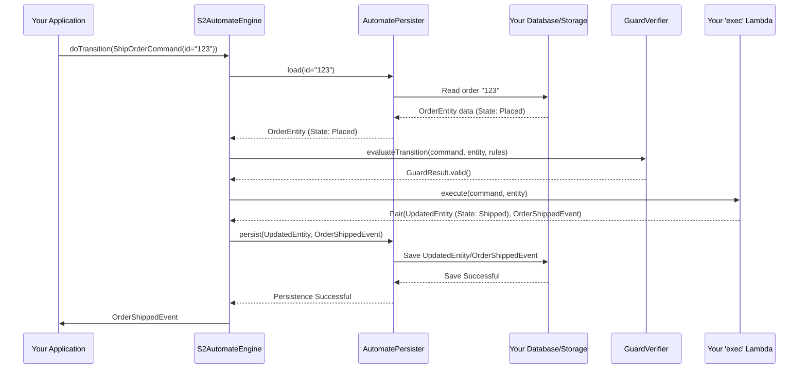

# Chapter 5: AutomatePersister (Persistence Layer)

In [Chapter 4: S2AutomateEngine (State Machine Execution Core)](04_s2automateengine__state_machine_execution_core__.md), we saw how the `S2AutomateEngine` is the heart of our state machine, processing commands and orchestrating state changes. But when an order is placed or shipped, where does that information go? If our application restarts, how do we remember the current state of all our orders? This is where the **`AutomatePersister`** comes in – it's the memory for our state machine.

## What's the Big Idea? Giving Your State Machine a Memory

Imagine our online order system. When a `PlaceOrderCommand` comes in, the `S2AutomateEngine` processes it, and a new order is created in the `Placed` state.
*   **Problem:** If this order information only exists in the computer's temporary memory, it will be lost if the application shuts down. We need to save it somewhere permanent, like a database.
*   **Solution:** The `AutomatePersister` is an interface that defines *how* the state of our order (or the events that led to its state) is saved and loaded.

Think of `AutomatePersister` as the **librarian for your state machine**.
*   When a new "book" (an order's state or an event) arrives, the librarian knows how to file it away on the "shelves" (your database, blockchain, or other storage).
*   When someone needs to read a book (load an order's current state), the librarian knows how to find it.

This special interface acts as a bridge between your state machine's logic and the actual storage system you choose. It **decouples** the FSM logic from the specific storage mechanism. This means your core state machine rules don't need to know if you're saving data to a traditional SQL database, a NoSQL database like MongoDB, or even a blockchain. You just need an `AutomatePersister` implementation that knows how to talk to your chosen storage.

## Key Responsibilities of `AutomatePersister`

The `AutomatePersister` is responsible for two main jobs:

1.  **Saving (Persisting):** When a state transition occurs, the `S2AutomateEngine` tells the `AutomatePersister` to save the result. This could be:
    *   Saving the entire new state of the entity (e.g., the `OrderEntity` is now `Shipped`). This is common in [State Storing (Architectural Pattern)](07_state_storing__architectural_pattern__.md).
    *   Saving the event that occurred (e.g., an `OrderShippedEvent`). This is fundamental to [Event Sourcing (Architectural Pattern)](06_event_sourcing__architectural_pattern__.md).
2.  **Loading:** When a command comes in for an existing entity (like a `ShipOrderCommand` for an existing order), the `S2AutomateEngine` needs to know the entity's current state. It asks the `AutomatePersister` to load this information from storage.

## How `AutomatePersister` Works with the Engine

You, as a developer using S2, typically don't call `AutomatePersister` methods directly in your day-to-day application logic. Instead, the [S2AutomateEngine (State Machine Execution Core)](04_s2automateengine__state_machine_execution_core__.md) uses it internally.

When you set up your S2 application, you'll configure the engine with a specific implementation of `AutomatePersister` that matches your chosen database or storage strategy.

Let's revisit the flow from Chapter 4 when a `ShipOrderCommand` is processed, now highlighting the persister's role:


Here, you can see the `AutomatePersister` is crucial for:
*   **Loading** the `OrderEntity` before the transition.
*   **Persisting** the `UpdatedEntity` (or the `OrderShippedEvent`) after the transition logic.

## The `AutomatePersister` Interface

Let's look at a simplified version of the `AutomatePersister` interface to understand its contract.
(From `s2-automate/s2-automate-core/src/commonMain/kotlin/s2/automate/core/persist/AutomatePersister.kt`)

```kotlin
// Simplified from AutomatePersister.kt
interface AutomatePersister<STATE, ID, ENTITY, EVENT, AUTOMATE> {

    // Saves the result of an initial creation
    suspend fun persistInit(
        // contexts: Flow of details about the new entity & event
    ): Flow<EVENT> // Returns a flow of the events that were persisted

    // Saves the result of a transition on an existing entity
    suspend fun persist(
        // contexts: Flow of details about the changed entity & event
    ): Flow<EVENT> // Returns a flow of the events that were persisted

    // Loads a single entity by its ID
    suspend fun load(context: AutomateContext<AUTOMATE>, id: ID & Any): ENTITY?

    // Loads multiple entities by their IDs
    suspend fun load(context: AutomateContext<AUTOMATE>, ids: Flow<ID & Any>): Flow<ENTITY?>
}
```
Let's break down the key methods:
*   `persistInit(...)`: Called by the engine after an `S2InitCommand` (like `PlaceOrderCommand`) successfully creates a new entity. It's responsible for saving this newly created entity and/or the initial event.
*   `persist(...)`: Called by the engine after an `S2Command` (like `ShipOrderCommand`) successfully transitions an existing entity to a new state. It saves the updated entity and/or the resulting event.
*   `load(...)`: Called by the engine when it needs to fetch the current state of one or more entities from storage.

The `ENTITY` generic type represents your actual data object (like `OrderEntity`), `EVENT` is your event type (like `OrderPlacedEvent`), `ID` is the type of your entity's identifier, and `STATE` is your state type (like `OrderState`).

## Implementations of `AutomatePersister`

S2 provides different implementations of `AutomatePersister` tailored for various storage strategies and frameworks. You don't usually write these from scratch; you pick one that fits your needs.

Here are a few examples:

1.  **`S2AutomateSourcingPersister.kt`** (For Event Sourcing)
    Located in `s2-spring/sourcing/s2-spring-boot-starter-sourcing/src/main/kotlin/s2/spring/automate/sourcing/persist/S2AutomateSourcingPersister.kt`
    This persister is used when you're following the [Event Sourcing (Architectural Pattern)](06_event_sourcing__architectural_pattern__.md). Its main job is to save *events* to an `EventRepository`.
    ```kotlin
    // Conceptual: How it might save an event
    class S2AutomateSourcingPersister<...> (
        private val eventStore: EventRepository<EVENT, ID>,
        // ... other dependencies ...
    ) : AutomatePersister<...> {
        // ...
        override suspend fun persist(...) /*: Flow<EVENT>*/ {
            // Simplified: it gets events from transitionContexts
            // and calls eventStore.persist(events)
            // ...
        }
    }
    ```
    It relies on an `EventRepository` (from `s2-event-sourcing/s2-event-sourcing-dsl/src/commonMain/kotlin/s2/sourcing/dsl/event/EventRepository.kt`) to actually store the events.

2.  **`SpringDataAutomateCoroutinePersisterFlow.kt`** (For State Storing with Spring Data)
    Located in `s2-spring/storing/s2-spring-boot-starter-storing-data/src/main/kotlin/s2/spring/automate/data/persister/SpringDataAutomateCoroutinePersisterFlow.kt`
    This persister is used for [State Storing (Architectural Pattern)](07_state_storing__architectural_pattern__.md) when using Spring Data. It saves the entire entity snapshot.
    ```kotlin
    // Conceptual: How it might save an entity
    class SpringDataAutomateCoroutinePersisterFlow<...> (
        private val repository: CoroutineCrudRepository<ENTITY, ID>,
        // ...
    ) : AutomatePersister<...> {
        // ...
        override suspend fun persist(...) /*: Flow<EVENT>*/ {
            // Simplified: it gets entities from transitionContexts
            // and calls repository.saveAll(entities)
            // ...
        }
    }
    ```
    It uses a Spring Data `CoroutineCrudRepository` to save and load entity snapshots directly.

3.  **`SsmAutomatePersister.kt`** (For Blockchain using SSM)
    Located in `s2-spring/storing/s2-spring-boot-starter-storing-ssm/src/main/kotlin/s2/spring/automate/ssm/persister/SsmAutomatePersister.kt`
    This persister is specialized for interacting with a Self-Sovereign Model (SSM) on a blockchain. It translates S2 state changes into SSM transactions.
    ```kotlin
    // Conceptual: How it might interact with SSM
    class SsmAutomatePersister<...> (
        // ...SSM specific functions like ssmSessionStartFunction...
    ) : AutomatePersister<...> {
        // ...
        override suspend fun persistInit(...) /*: Flow<EVENT>*/ {
            // Simplified: it prepares SsmSessionStartCommand
            // and calls ssmSessionStartFunction.invoke(...)
            // ...
        }
    }
    ```
    This shows how `AutomatePersister` can adapt to very different storage backends, including distributed ledgers.

The key takeaway is that the `AutomatePersister` interface provides a consistent way for the `S2AutomateEngine` to request saving and loading, regardless of the underlying storage technology.

## Conclusion

You've now learned about `AutomatePersister`, the crucial component that gives your S2 state machine its memory!
*   It defines **how state or events are saved and loaded**.
*   It acts as an **abstraction layer**, decoupling your FSM logic from specific database technologies.
*   The [S2AutomateEngine (State Machine Execution Core)](04_s2automateengine__state_machine_execution_core__.md) relies on an `AutomatePersister` implementation to handle all persistence needs.
*   Whether you're doing event sourcing or state storing, an `AutomatePersister` is involved.

Understanding the role of `AutomatePersister` is key to seeing how S2 manages data over time. It ensures that your state machine's history and current status are not lost.

In the next two chapters, we'll dive deeper into the two main architectural patterns that heavily influence how `AutomatePersister` is used: [Event Sourcing (Architectural Pattern)](06_event_sourcing__architectural_pattern__.md) and [State Storing (Architectural Pattern)](07_state_storing__architectural_pattern__.md).

---

Generated by [AI Codebase Knowledge Builder](https://github.com/The-Pocket/Tutorial-Codebase-Knowledge)