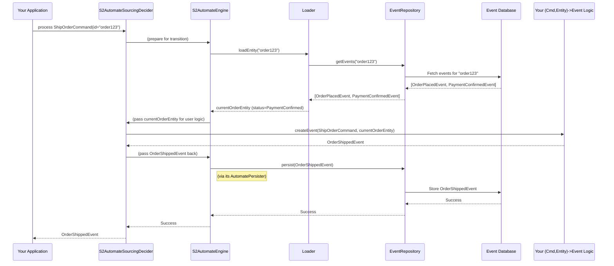

# Chapter 6: Event Sourcing (Architectural Pattern)

Welcome back! In [Chapter 5: AutomatePersister (Persistence Layer)](05_automatepersister__persistence_layer__.md), we learned how the `AutomatePersister` is responsible for saving and loading our application's data, acting as the memory for our state machine. Now, we're going to explore a specific and powerful way to use this persistence: **Event Sourcing**.

## What's the Big Idea? Keeping a Perfect History

Imagine you're managing an online order. Typically, you might just store its current status: "Order Shipped."
But what if you needed to answer these questions:
*   When exactly was this order placed?
*   What were the items in the order when it was first placed?
*   Was the payment confirmed before or after an item was added?
*   How did the order reach its current "Shipped" state, step-by-step?

If you only store the *current* state, answering these historical questions can be difficult or impossible.

**Event Sourcing** is an architectural pattern that solves this. Instead of storing just the current state of an entity (like our order), Event Sourcing records **every single change (called an event)** that has ever happened to that entity.

Think of it like a **bank ledger**. A ledger doesn't just show your current balance. It meticulously records every deposit (credit) and every withdrawal (debit). Your current balance is simply the result of applying all those transactions from the beginning.

With EventSourcing:
*   **Every change is an Event**: "OrderPlaced," "ItemAddedToOrder," "PaymentConfirmed," "OrderShipped."
*   **Events are facts**: They are immutable (they don't change once recorded).
*   **The current state is derived**: To find out the current state of an order, you "replay" all its events in order.

This gives you a complete, auditable history of everything that happened.

## Our Use Case: Tracking an Order's Full Lifecycle

Let's stick with our online order. We want to use Event Sourcing to track its journey.
1.  Customer places an order for a "SuperS2 Book." -> `OrderPlacedEvent`
2.  Customer adds a "MegaMug" to the same order. -> `ItemAddedToOrderEvent`
3.  Payment is confirmed. -> `PaymentConfirmedEvent`
4.  Order is shipped. -> `OrderShippedEvent`

Instead of just having an `OrderEntity` that says `status: Shipped`, we'll have a list of these events. If we want to know the current items in the order, we replay the `OrderPlacedEvent` and then the `ItemAddedToOrderEvent`.

## Key S2 Components for Event Sourcing

S2 provides specific tools to help you implement Event Sourcing:

1.  **Events**: These are the stars of the show! We defined them in [Chapter 2: Commands & Events (Interaction Primitives)](02_commands___events__interaction_primitives__.md). In Event Sourcing, these events are what get stored permanently.
    *Example*: `OrderPlacedEvent(id="order123", items=["S2 Book"], timestamp=...)`

2.  **`S2AutomateSourcingDecider`**: This component is central to processing [Commands](02_commands___events__interaction_primitives__.md) in an Event Sourcing setup. When it receives a command, its job is not to directly change a stateful entity, but to *decide* what new event(s) should be generated.
    *   It uses your `S2Automate` definition (from [Chapter 1](01_s2automate__finite_state_machine_definition__.md)) and any [Guards](03_guards__transition_pre_conditions__.md) to validate the command.
    *   You provide it with logic (often a small lambda function) that takes the command and the current state (derived from past events) and returns the new event to be created.

3.  **`EventRepository`**: This is the "ledger book" itself. It's a specialized kind of persister.
    *   **Stores Events**: When the `S2AutomateSourcingDecider` generates a new event, this event is handed to the `EventRepository` to be saved.
    *   **Retrieves Events**: When you need to know the current state of an entity, the `EventRepository` fetches all its past events.
    *Example methods*: `persist(event)`, `loadEvents(entityId)`

4.  **`View` (and `Loader`s like `ViewLoader` or `SnapLoader`)**: Since we only store events, how do we get the current state (e.g., the current `OrderEntity` object)?
    *   A **`View`** defines how an entity's state changes in response to an event. It typically has an `evolve` function: `(currentState, event) -> newState`.
        ```kotlin
        // Conceptual View for an Order
        class OrderView : View<OrderEvent, OrderEntity?> {
            override suspend fun evolve(event: OrderEvent, model: OrderEntity?): OrderEntity? {
                return when (event) {
                    is OrderPlacedEvent -> OrderEntity(id = event.id, items = event.items, status = "Placed")
                    is ItemAddedToOrderEvent -> model?.copy(items = model.items + event.item, status = "Pending")
                    is OrderShippedEvent -> model?.copy(status = "Shipped")
                    // ... other event types ...
                    else -> model // Or throw error for unknown event
                }
            }
        }
        ```
        This function takes the current `OrderEntity` (or `null` if it's the first event) and an `OrderEvent`, and returns the new `OrderEntity` state.

    *   A **`Loader`** (like `ViewLoader`) uses a `View` to build the current state. It fetches all events for an entity from the `EventRepository` and applies them one-by-one using the `View`'s `evolve` function.
        ```kotlin
        // Conceptual: How a Loader might get current state
        // val orderLoader = ViewLoader(eventRepository, orderView)
        // val currentOrder = orderLoader.load("order123")
        ```
        `SnapLoader` is an optimization where the system might periodically save a snapshot of the derived state to avoid replaying very long lists of events every time.

## How Event Sourcing Works in S2: A Walkthrough

Let's see how these components work together when a `ShipOrderCommand` arrives for "order123".

1.  **Command Arrives**: Your application sends `ShipOrderCommand(id="order123")` to an `S2AutomateSourcingDecider`.

2.  **Load Current State**: The `S2AutomateSourcingDecider` (often using the [S2AutomateEngine](04_s2automateengine__state_machine_execution_core__.md) internally) needs to know the current state of "order123" to validate the command.
    *   It asks a `Loader` component for the current `OrderEntity` for "order123".
    *   The `Loader` calls `eventRepository.loadEvents("order123")`.
    *   The `EventRepository` fetches all stored events for "order123". Let's say it returns:
        *   `OrderPlacedEvent(id="order123", items=["Book"], ...)`
        *   `PaymentConfirmedEvent(id="order123", ...)`
    *   The `Loader` uses your `OrderView.evolve` logic to replay these events:
        *   `evolve(null, OrderPlacedEvent)` -> `OrderEntity(id="order123", items=["Book"], status="Placed")`
        *   `evolve(OrderEntity(status="Placed"), PaymentConfirmedEvent)` -> `OrderEntity(id="order123", items=["Book"], status="PaymentConfirmed")`
    *   The `Loader` now has the `currentOrderEntity` (state: PaymentConfirmed).

3.  **Process Command & Generate Event**:
    *   The `S2AutomateEngine` (used by the `S2AutomateSourcingDecider`) checks the `S2Automate` rules (e.g., "Can an order transition from `PaymentConfirmed` when a `ShipOrderCommand` is received?") and any [Guards](03_guards__transition_pre_conditions__.md).
    *   If valid, the `S2AutomateSourcingDecider` calls the specific logic you provided for the `ShipOrderCommand`. This logic takes the `currentOrderEntity` and the `ShipOrderCommand` and decides what event should happen.
        ```kotlin
        // Your logic inside the S2AutomateSourcingDecider configuration for ShipOrderCommand
        // (command, currentOrderEntity) -> {
        //   // You might do some checks on currentOrderEntity here
        //   OrderShippedEvent(id = command.id, shippingDate = Clock.System.now())
        // }
        ```
    *   This logic produces an `OrderShippedEvent`.

4.  **Persist Event**:
    *   The `S2AutomateSourcingDecider` (via the `S2AutomateEngine` and its `AutomatePersister`, which in this case would be event-sourcing aware) gives the `OrderShippedEvent` to the `EventRepository`.
    *   `eventRepository.persist(OrderShippedEvent)`.
    *   The `EventRepository` stores this new event. Now, for "order123", the stored events are:
        *   `OrderPlacedEvent(...)`
        *   `PaymentConfirmedEvent(...)`
        *   `OrderShippedEvent(...)`

5.  **Return Result**: The `S2AutomateSourcingDecider` typically returns the newly created `OrderShippedEvent` to your application.

The `OrderEntity` object itself is not directly stored. Only the events are. The entity is always reconstructed from events when needed.

## Under the Hood: A Simplified Flow

Let's visualize the process for handling a `ShipOrderCommand`:



### Key Code Files and Concepts:

*   **`S2AutomateSourcingDecider.kt` / `S2AutomateSourcingDeciderFlow.kt` / `S2AutomateSourcingDeciderImpl.kt`**:
    *   Location: `s2-automate/s2-automate-core/src/commonMain/kotlin/s2/automate/core/sourcing/`
    *   The `S2AutomateSourcingDeciderImpl` brings together the `S2AutomateEngine`, a `Loader` (for projections), and an `EventRepository`.
    *   It provides methods like `decide` (for flows) or `init`/`transition` (for single command/event).
    *   When you call its methods, you provide a lambda that defines how to generate an event from a command and the current entity state.
    ```kotlin
    // From S2AutomateSourcingDeciderImpl.kt (simplified concept for a transition)
    // User calls: decider.decide(commandsFlow) { cmd, currentEntity -> /* return NewEvent */ }
    // Internally, it uses S2AutomateEngine.doTransition:
    /*
    automateExecutor.doTransition(...) { commandEnvelope, currentEntityLoadedByEngine ->
        // 1. `currentEntityLoadedByEngine` is loaded by engine's persister (which must be event-sourcing aware)
        // 2. `newEvent = yourLambda(commandEnvelope.data, currentEntityLoadedByEngine)`
        // 3. `updatedProjectedEntity = projectionLoader.evolve(newEvent, currentEntityLoadedByEngine)`
        // 4. Returns Pair(updatedProjectedEntity, newEvent) to the engine.
        // Engine's persister then saves `newEvent` to the EventRepository.
    }
    */
    ```
    The `S2AutomateSourcingDeciderImpl` uses the `S2AutomateEngine` for core FSM logic. The engine, in turn, relies on an [AutomatePersister (Persistence Layer)](05_automatepersister__persistence_layer__.md). For Event Sourcing, this persister (e.g., `S2AutomateSourcingPersister`) would be configured to load entities by replaying events (likely using a `Loader`) and to persist only the generated events into the `EventRepository`.

*   **`EventRepository.kt`**:
    *   Location: `s2-event-sourcing/s2-event-sourcing-dsl/src/commonMain/kotlin/s2/sourcing/dsl/event/EventRepository.kt`
    *   Defines the contract for storing and retrieving event streams.
    ```kotlin
    interface EventRepository<EVENT, ID> where EVENT : Evt, EVENT : WithS2Id<ID> {
        suspend fun load(id: ID): Flow<EVENT> // Load events for one ID
        suspend fun loadAll(): Flow<EVENT>   // Load all events (e.g., for replays)
        suspend fun persist(event: EVENT): EVENT
        // ... other methods ...
    }
    ```
    Implementations like `EventPersisterSsm.kt` (for blockchain) or others for SQL/NoSQL databases would implement this interface.

*   **`View.kt`**:
    *   Location: `s2-event-sourcing/s2-event-sourcing-dsl/src/commonMain/kotlin/s2/sourcing/dsl/view/View.kt`
    *   Defines how an entity state evolves with each event.
    ```kotlin
    interface View<EVENT, ENTITY> where EVENT: Evt {
        // Applies an event to a model (entity state) to get the new model state
        suspend fun evolve(event: EVENT, model: ENTITY?): ENTITY?
    }
    ```

*   **`Loader.kt`**:
    *   Location: `s2-event-sourcing/s2-event-sourcing-dsl/src/commonMain/kotlin/s2/sourcing/dsl/Loader.kt`
    *   Uses a `View` and an `EventRepository` to build entity states.
    ```kotlin
    interface Loader<EVENT: Any, ENTITY, ID> {
        // Load current entity state by ID (fetches events & applies view)
        suspend fun load(id: ID & Any): ENTITY?
        // Evolve an existing entity state with new events
        suspend fun evolve(events: Flow<EVENT>, entity: ENTITY? = null): ENTITY?
        // ... other methods like reloadHistory ...
    }
    ```

## Benefits of Event Sourcing

Why go through all this trouble?
*   **Full Audit Trail**: You have a complete history of every change. This is invaluable for compliance, debugging, and understanding system behavior.
*   **Debugging**: If an entity is in an unexpected state, you can replay its events step-by-step to see exactly how it got there.
*   **Temporal Queries**: You can reconstruct the state of an entity at *any point in the past* by replaying events up to that time.
*   **Flexibility for Future Needs**: Since you store all events, you can create new "views" or "projections" of your data later without losing historical information. For example, you could create a new report that analyzes order modification patterns, even if you didn't plan for it initially.
*   **Decoupling**: Command processing (generating events) is decoupled from how state is projected or queried.

## Conclusion

Event Sourcing is a powerful pattern that shifts the focus from storing the current state to storing a sequence of events that describe how the state was reached. `S2AutomateSourcingDecider` helps process commands to generate these events, `EventRepository` stores them, and `View`s with `Loader`s allow you to derive the current state from this rich history.

This approach provides a robust audit trail and great flexibility for understanding and evolving your system over time.

But what if you don't need such a detailed history and prefer a simpler way to just store the current state? S2 supports that too! In the next chapter, we'll explore the alternative: [State Storing (Architectural Pattern)](07_state_storing__architectural_pattern__.md).

---

Generated by [AI Codebase Knowledge Builder](https://github.com/The-Pocket/Tutorial-Codebase-Knowledge)