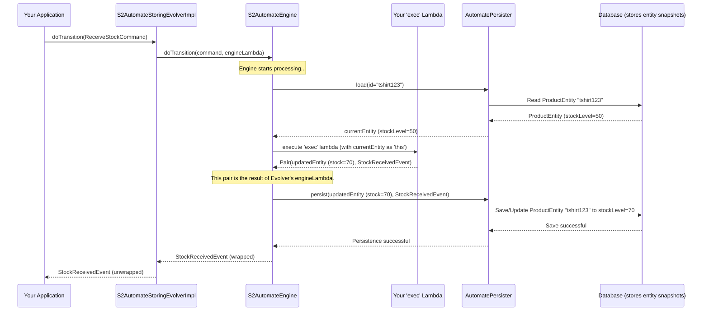

# Chapter 7: State Storing (Architectural Pattern)

In the [previous chapter, Event Sourcing (Architectural Pattern)](06_event_sourcing__architectural_pattern__.md), we explored a powerful way to keep a full history of every change by storing events. This is fantastic for auditing and understanding how things evolved. However, not every application needs such a detailed history. Sometimes, you just want to know the *latest* status of something, quickly and simply.

This is where **State Storing** comes in!

## What's the Big Idea? Keeping Only the Latest Snapshot

Imagine you're writing a document. You make some changes, save it. Make more changes, save it again. Usually, your computer keeps the latest version of the document. You don't typically keep every single version from every save, unless you're using a special version control system.

State Storing in software is like that:
*   **Only the current state of an entity is stored.**
*   When a command modifies the entity, the system directly updates this stored state to its new version.

Think of an online shopping cart. You add an item, the cart updates. You remove an item, it updates again. You usually care about *what's in the cart right now*, not necessarily the detailed history of every add and remove action (though for some analytics, event sourcing might be useful there too!). For basic cart functionality, state storing is often simpler.

Compared to Event Sourcing, State Storing:
*   Is often simpler to implement and understand for basic use cases.
*   Can be faster for reading the current state because you fetch it directly.
*   Lacks the rich, built-in audit trail that Event Sourcing provides.

## Our Use Case: A Simple Product Inventory

Let's say we're managing the stock level for products in an online store.
*   Product: "SuperS2 T-Shirt"
*   Current Stock: 50 units

When we receive a new shipment, we want to update the stock. If 20 T-Shirts arrive:
*   **Command:** `ReceiveStockCommand(productId="tshirt123", quantity=20)`
*   **Action:** The system should update the stock of "SuperS2 T-Shirt" from 50 to 70.
*   **Resulting Event:** `StockReceivedEvent(productId="tshirt123", newStockLevel=70)`

With State Storing, our database would just store `productId="tshirt123", stockLevel=70`. It wouldn't necessarily keep a separate record of "stock was 50, then 20 were added."

## Key S2 Component for State Storing: `S2AutomateStoringEvolver`

For the State Storing pattern, S2 provides a key helper called `S2AutomateStoringEvolver`. This component, often working hand-in-hand with the [S2AutomateEngine (State Machine Execution Core)](04_s2automateengine__state_machine_execution_core__.md), helps manage how an entity's state is "evolved" or changed.

Here's the core idea:
1.  A [Command](02_commands___events__interaction_primitives__.md) comes in (e.g., `ReceiveStockCommand`).
2.  The [S2AutomateEngine (State Machine Execution Core)](04_s2automateengine__state_machine_execution_core__.md) loads the current state of your entity (e.g., `ProductEntity` with `stockLevel=50`) using an [AutomatePersister (Persistence Layer)](05_automatepersister__persistence_layer__.md) configured for state storing.
3.  You provide logic to `S2AutomateStoringEvolver` that says: "Given this command and the current entity, here's the **new entity state** and the **event** that occurred."
    *   For our example:
        *   New `ProductEntity` has `stockLevel=70`.
        *   `StockReceivedEvent` is created.
4.  The `S2AutomateStoringEvolver` (via the engine) then ensures this new `ProductEntity` (with `stockLevel=70`) is saved by the [AutomatePersister (Persistence Layer)](05_automatepersister__persistence_layer__.md).

Your main job is to define that transformation: `(currentEntity, command) -> (newEntity, event)`.

## How State Storing Works in S2: A Walkthrough

Let's trace our `ReceiveStockCommand` for the "SuperS2 T-Shirt".

**1. Define our Entity, Command, and Event**

First, we need our data structures (simplified):
```kotlin
import s2.dsl.automate.S2State
import s2.dsl.automate.S2Command
import s2.dsl.automate.S2InitCommand
import s2.dsl.automate.Evt
import s2.dsl.automate.model.WithS2Id
import s2.dsl.automate.model.WithS2State

// Dummy State (could be more complex)
@kotlinx.serialization.Serializable
object ProductActiveState : S2State { override val position = 0 }

// Our Product Entity
data class ProductEntity(
    override val s2Id: String, // Product ID
    var stockLevel: Int,
    override var s2State: S2State = ProductActiveState // Current state
) : WithS2Id<String>, WithS2State<S2State>

// Command to receive stock
data class ReceiveStockCommand(
    override val id: String, // Product ID
    val quantityReceived: Int
) : S2Command<String>

// Event for stock received
data class StockReceivedEvent(
    val productId: String,
    val newStockLevel: Int,
    val quantityChange: Int
) : Evt // Implements a base Event marker
```
*   `ProductEntity`: Holds the product's ID and current stock level. It implements `WithS2Id` and `WithS2State` as expected by S2.
*   `ReceiveStockCommand`: Carries the product ID and the quantity of stock received.
*   `StockReceivedEvent`: Records the outcome.

**2. Using `S2AutomateStoringEvolver` (Conceptual)**

You'd typically use an implementation of `S2AutomateStoringEvolver`, like `S2AutomateStoringEvolverImpl` or the Spring-friendly `S2AutomateExecutorSpring`. Let's imagine we have an `evolver` instance.

To handle the `ReceiveStockCommand`:
```kotlin
// evolver: an instance of S2AutomateStoringEvolver
// assume productEntity is already loaded by the S2 engine
// and has s2Id = "tshirt123", stockLevel = 50

val command = ReceiveStockCommand(id = "tshirt123", quantityReceived = 20)

// The 'exec' lambda defines how to get the new entity and event
val event: StockReceivedEvent = evolver.doTransition(command) {
    // 'this' refers to the current ProductEntity (stockLevel = 50)
    val newStock = this.stockLevel + command.quantityReceived // 50 + 20 = 70
    val updatedEntity = this.copy(stockLevel = newStock) // New entity snapshot

    val eventGenerated = StockReceivedEvent(
        productId = this.s2Id,
        newStockLevel = newStock,
        quantityChange = command.quantityReceived
    )
    // Return the updated entity and the event
    Pair(updatedEntity, eventGenerated)
}

// After this:
// - 'event' will be StockReceivedEvent(productId="tshirt123", newStockLevel=70, quantityChange=20)
// - The S2 system (via AutomatePersister) would have saved the 'updatedEntity'
//   (ProductEntity with stockLevel=70) to the database.
```
The magic happens in the `exec` lambda provided to `doTransition`:
*   It receives the current `ProductEntity` as `this`.
*   It calculates the `newStock`.
*   It creates `updatedEntity` – this is the **new snapshot** of the product.
*   It creates `eventGenerated` to signify what happened.
*   It returns both. The `S2AutomateStoringEvolver` ensures the `updatedEntity` is what gets persisted as the new current state.

## Under the Hood: Simplified Flow

Here's what happens when `evolver.doTransition` is called:


The `S2AutomateStoringEvolverImpl` uses the `S2AutomateEngine` under the hood. Your `exec` lambda becomes part of the logic the engine executes. The crucial difference from Event Sourcing is that the `AutomatePersister` is configured to save the *entire `updatedEntity` snapshot* rather than just the event.

### Key Code Components:

1.  **`S2AutomateStoringEvolver.kt` (Interface)**
    *   Location: `s2-automate/s2-automate-core/src/commonMain/kotlin/s2/automate/core/storing/S2AutomateStoringEvolver.kt`
    *   This interface defines the contract for evolving state in a storing pattern.
    ```kotlin
    // Simplified from S2AutomateStoringEvolver.kt
    interface S2AutomateStoringEvolver<STATE, ID, ENTITY, EVENT> {
        // For creating new entities
        suspend fun <EVENT_OUT: EVENT> createWithEvent(
            command: S2InitCommand,
            build: suspend () -> Pair<ENTITY, EVENT_OUT> // You build entity & event
        ): EVENT_OUT

        // For transitioning existing entities
        suspend fun <EVENT_OUT: EVENT> doTransition(
            command: S2Command<ID>,
            exec: suspend ENTITY.() -> Pair<ENTITY, EVENT_OUT> // You update entity & build event
        ): EVENT_OUT
    }
    ```
    *   The `build` and `exec` lambdas are where you define how the entity's state changes and what event is produced. The returned `ENTITY` from these lambdas is the new state to be persisted.

2.  **`S2AutomateStoringEvolverImpl.kt` (Implementation)**
    *   Location: `s2-automate/s2-automate-core/src/commonMain/kotlin/s2/automate/core/storing/S2AutomateStoringEvolverImpl.kt`
    *   This is the standard implementation. It takes an `S2AutomateEngine` instance (`automateExecutor`) in its constructor.
    ```kotlin
    // Simplified constructor and doTransition logic
    open class S2AutomateStoringEvolverImpl<STATE, ENTITY, ID>(
        private val automateExecutor: S2AutomateEngine<STATE, ENTITY, ID, Evt>,
        // ...
    ) {
        suspend fun <EVENT_OUT : Evt> doTransition(
            command: S2Command<ID>,
            execUserLambda: suspend ENTITY.() -> Pair<ENTITY, EVENT_OUT>,
        ): EVENT_OUT {
            // It calls the S2AutomateEngine's doTransition method...
            val eventEnvelope = automateExecutor.doTransition(
                flowOf(command.asEnvelopeWithType(type ="Cmd")) // Wrap command
            ) { cmdEnvelope, currentEntity ->
                // ...and inside the engine's lambda, your lambda is executed!
                // 'currentEntity' is passed as 'this' to your execUserLambda
                val (entityUpdated, eventData) = currentEntity.execUserLambda()

                // The engine expects the updated entity and the event (wrapped)
                entityUpdated to cmdEnvelope.mapEnvelopeWithType({ eventData }, type = "Evt")
            }.first() // We expect one event out for one command

            // publisher.publish(eventEnvelope) // Optionally publish to an event bus
            return eventEnvelope.data // Return the raw event
        }
    }
    ```
    *   `S2AutomateStoringEvolverImpl` essentially adapts your simpler `(ENTITY_IN) -> Pair<ENTITY_OUT, EVENT_OUT>` lambda into the `(COMMAND, ENTITY_IN) -> Pair<ENTITY_OUT, EVENT_OUT>` structure that the `S2AutomateEngine` expects for its `exec` block.
    *   The [AutomatePersister (Persistence Layer)](05_automatepersister__persistence_layer__.md) used by the `automateExecutor` (engine) would be one that saves entity snapshots, like `SpringDataAutomateCoroutinePersisterFlow.kt` if you're using Spring Data.

3.  **`S2AutomateExecutorSpring.kt` (Spring Convenience Wrapper)**
    *   Location: `s2-spring/storing/s2-spring-boot-starter-storing/src/main/kotlin/s2/spring/automate/executor/S2AutomateExecutorSpring.kt`
    *   This class is a higher-level utility for Spring applications. It internally uses `S2AutomateStoringEvolverImpl`.
    ```kotlin
    open class S2AutomateExecutorSpring<STATE, ID, ENTITY> : S2AutomateStoringEvolver<...> {
        protected lateinit var engine: S2AutomateStoringEvolverImpl<STATE, ENTITY, ID>

        fun withContext(
            automateExecutorFlow: S2AutomateEngineImpl<STATE, ID, ENTITY, Evt>,
            // ...
        ) {
            // It initializes its internal 'engine' (S2AutomateStoringEvolverImpl)
            this.engine = S2AutomateStoringEvolverImpl(automateExecutorFlow, /*...publisher...*/ )
        }

        // Its methods delegate to this internal engine:
        override suspend fun <EVENT_OUT : Evt> doTransition(
            command: S2Command<ID>,
            exec: suspend ENTITY.() -> Pair<ENTITY, EVENT_OUT>,
        ): EVENT_OUT = engine.doTransition(command, exec)
        // ... other methods similarly delegate ...
    }
    ```
    *   This makes it easier to set up State Storing behavior in a Spring Boot application by wiring up the necessary S2 components.

## Benefits of State Storing

*   **Simplicity**: For many straightforward scenarios, it's easier to reason about and implement than Event Sourcing. You're dealing directly with the current state.
*   **Performance for Reads**: Fetching the current state is typically fast as it's a direct lookup of the latest snapshot.
*   **Integration**: Often integrates more naturally with traditional Object-Relational Mappers (ORMs) or document databases that expect to store and retrieve whole objects.

## Drawbacks of State Storing

*   **Loss of Audit Trail**: You don't have a built-in, detailed history of how an entity reached its current state. If you need this, Event Sourcing is better.
*   **Difficult Temporal Queries**: Answering "What did this entity look like last Tuesday?" is hard or impossible without additional logging or snapshotting mechanisms.
*   **Debugging Complex Histories**: If an entity gets into a weird state, it can be harder to trace back why, compared to replaying events.

## Conclusion

State Storing is a traditional and often simpler architectural pattern where you persist only the current state of your entities. S2 supports this pattern effectively using `S2AutomateStoringEvolver` (and its implementations like `S2AutomateStoringEvolverImpl` or `S2AutomateExecutorSpring`). You provide the logic to transform an entity from its current state to a new state in response to a command, and S2 handles the persistence of this new state.

This approach is excellent for use cases where a detailed historical audit trail isn't a primary concern, and you prioritize simplicity and direct access to the latest data.

Both State Storing and Event Sourcing are powerful patterns, and S2 gives you the flexibility to choose the one that best fits your needs.

In the next chapter, [Spring Integration Adapters](08_spring_integration_adapters_.md), we'll delve into how S2 integrates with the Spring framework, making it easier to build robust applications using either of these architectural patterns.

---

Generated by [AI Codebase Knowledge Builder](https://github.com/The-Pocket/Tutorial-Codebase-Knowledge)