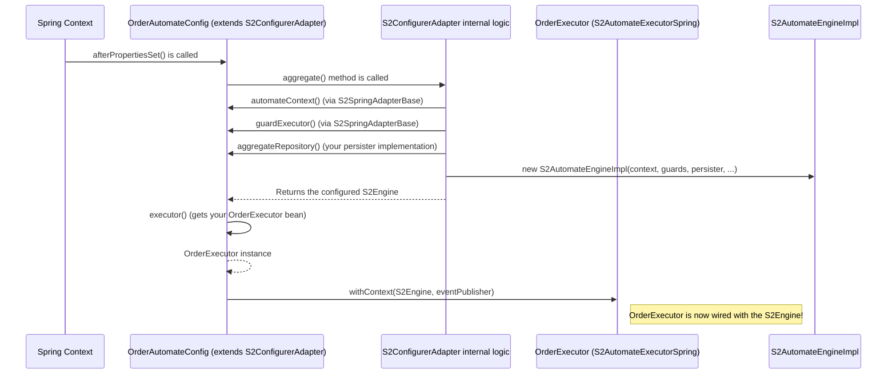

# Chapter 8: Spring Integration Adapters

Welcome to the final chapter of our S2 beginner's journey! In [Chapter 7: State Storing (Architectural Pattern)](07_state_storing__architectural_pattern__.md), we learned about a simpler way to persist our data by just keeping the latest snapshot. Throughout this series, we've built up a good understanding of S2's core concepts: defining state machines ([`S2Automate`](01_s2automate__finite_state_machine_definition__.md)), using [Commands & Events](02_commands___events__interaction_primitives__.md), setting up [Guards](03_guards__transition_pre_conditions__.md), understanding the [Engine](04_s2automateengine__state_machine_execution_core__.md), the [Persister](05_automatepersister__persistence_layer__.md), and choosing between [Event Sourcing](06_event_sourcing__architectural_pattern__.md) and [State Storing](07_state_storing__architectural_pattern__.md).

Now, how do we make all these powerful S2 pieces work smoothly within a popular framework like Spring Boot? This is where **Spring Integration Adapters** come into play!

## What's the Big Idea? Plugging S2 into Spring

Imagine you've built a fantastic custom electronic gadget (that's your S2 state machine logic). Now you want to use it in different countries, but they all have different power outlets (that's the Spring Boot framework). You need an adapter plug!

Spring Integration Adapters in S2 are exactly like that. They are special classes that:
*   **Bridge S2 with Spring Boot**: They connect your S2 automates to the Spring ecosystem.
*   **Simplify Configuration**: They handle much of the boilerplate setup, making it easy to configure and use S2 components as Spring beans.
*   **Enable Dependency Injection**: They help Spring manage and inject S2 components like engines, persisters, and event publishers where you need them.

**Use Case:** Let's say we have our `OrderAutomate` from [Chapter 1](01_s2automate__finite_state_machine_definition__.md). We want to create a web application using Spring Boot where users can send a request (an HTTP POST) to place an order. Our Spring `Controller` needs a clean and simple way to tell the S2 system, "Hey, process this `PlaceOrderCommand`!" The Spring Adapters make this interaction straightforward.

Without these adapters, you'd have to manually instantiate and wire up all the S2 components (engine, persister, guards, etc.) within your Spring application, which can be complex and error-prone. The adapters streamline this process significantly.

## The Adapter Family: Key Players

There are a few key adapter classes that work together. Think of them as parts of a modular adapter plug system.

### 1. `S2SpringAdapterBase`: The Foundation

*   **What it is**: This is the common base class for other, more specific Spring adapters.
*   **What it does**: It provides shared setup logic that's useful whether you're doing state storing or event sourcing. For example, it helps set up:
    *   The `AutomateContext` (which holds your `S2Automate` definition).
    *   The `GuardVerifier` (which runs your [Guards](03_guards__transition_pre_conditions__.md), including the default `TransitionStateGuard` that checks if a transition is defined).
    *   An `AutomateEventPublisher` that can publish S2's internal application events using Spring's eventing system (`SpringEventPublisher`).
    *   It also automatically wires in `S2BatchProperties` for configuring batch processing, if needed.
*   **Analogy**: Think of it as the main body of an electrical adapter plug. It has the core structure, and then specific pins (other adapters) can attach to it for different types of outlets.

You usually don't use `S2SpringAdapterBase` directly but extend one of its specialized children.
Here's a glimpse of what it provides (conceptually, from `s2-spring/s2-spring-core/src/main/kotlin/s2/spring/core/S2SpringAdapterBase.kt`):
```kotlin
// S2SpringAdapterBase.kt - Conceptual
abstract class S2SpringAdapterBase<...> {
    // Provides the S2Automate rulebook
    abstract fun automate(): S2Automate

    // Sets up the context with the rulebook
    protected open fun automateContext() = AutomateContext(automate(), /*...batchParams...*/ )

    // Configures guards
    protected open fun guardExecutor(...) = GuardVerifierImpl(guards(), /*...publisher...*/ )

    // Default guards (can be overridden)
    protected open fun guards() = listOf(TransitionStateGuard())
    // ... other common setup ...
}
```
This base class ensures that fundamental S2 components are configured correctly within the Spring environment.

### 2. `S2ConfigurerAdapter`: For State-Storing Automates

*   **What it is**: This adapter is your go-to choice if you're using the [State Storing (Architectural Pattern)](07_state_storing__architectural_pattern__.md).
*   **What it does**: It builds upon `S2SpringAdapterBase` to specifically configure an [S2AutomateEngine](04_s2automateengine__state_machine_execution_core__.md) that's tailored for state storing.
    *   You'll tell it which [AutomatePersister](05_automatepersister__persistence_layer__.md) to use for saving and loading entity snapshots (e.g., one that talks to a Spring Data repository or an SSM persister for blockchain).
    *   It helps set up an `S2AutomateExecutorSpring` instance. This executor (which we saw in Chapter 7 as a type of `S2AutomateStoringEvolver`) is what your Spring services will interact with to send commands and get back events.
*   **Analogy**: This is like a specific pin on our adapter plug designed for simple appliances that just need their current "on" or "off" state remembered (state storing).

If you're building a state-storing system, you'll create a class that extends `S2ConfigurerAdapter`.
```kotlin
// MyOrderStateStoringConfig.kt (Conceptual)
// You would extend S2ConfigurerAdapter for state storing
// class MyOrderStateStoringConfig : S2ConfigurerAdapter<OrderState, OrderId, OrderEntity, OrderExecutor>() {
//     override fun automate(): S2Automate = orderAutomate // Your S2 definition
//     override fun aggregateRepository(): AutomatePersister<...> = myStatePersister
//     override fun executor(): OrderExecutor = OrderExecutor() // Your command handler
// }
```
We'll see a more concrete example later.

### 3. `S2AutomateDeciderSpringAdapter`: For Event-Sourced Automates

*   **What it is**: This adapter is designed for the [Event Sourcing (Architectural Pattern)](06_event_sourcing__architectural_pattern__.md).
*   **What it does**: Also extending `S2SpringAdapterBase`, this adapter configures an [S2AutomateEngine](04_s2automateengine__state_machine_execution_core__.md) suited for event sourcing.
    *   You'll provide it with an `EventRepository` (to store events), a `View` (to define how entities are built from events), and optionally a `SnapRepository` (for snapshots).
    *   It helps set up an `S2AutomateDeciderSpring` instance. This "decider" (which we met in Chapter 6) is what your Spring services will use to send commands, leading to the generation and storage of new events.
*   **Analogy**: This is another specific pin for our adapter plug, but this one is for devices that keep a detailed log of everything they do (event sourcing), like a security camera recording all events.

If you're building an event-sourced system, your configuration class would extend `S2AutomateDeciderSpringAdapter`.
```kotlin
// MyOrderEventSourcingConfig.kt (Conceptual)
// You would extend S2AutomateDeciderSpringAdapter for event sourcing
// class MyOrderEventSourcingConfig : S2AutomateDeciderSpringAdapter<OrderEntity, OrderState, OrderEvent, OrderId, OrderDecider>() {
//     override fun automate(): S2Automate = orderAutomate
//     override fun eventStore(): EventRepository<OrderEvent, OrderId> = myEventRepository
//     override fun entityType(): KClass<OrderEvent> = OrderEvent::class
//     // You also provide the 'executor' (your OrderDecider) and 'view' in the constructor
// }
```

## Using Adapters: Let's Plug In Our Order System (State Storing Example)

Let's revisit our use case: We have an `OrderAutomate` and want to expose a Spring Boot HTTP endpoint to place an order. We'll use the **State Storing** pattern for simplicity here.

**Step 1: Define our Order Components (Quick Recap)**
Assume we have `OrderState`, `OrderId`, `OrderEntity`, `PlaceOrderCommand`, `OrderPlacedEvent`, and our `orderAutomate` definition from previous chapters.

**Step 2: Create the `S2AutomateExecutorSpring` for Orders**
This class will handle the actual command processing logic. It extends `S2AutomateExecutorSpring` (which is a specialized `S2AutomateStoringEvolver` from [Chapter 7](07_state_storing__architectural_pattern__.md)).

```kotlin
// OrderExecutor.kt
import org.springframework.stereotype.Service
import s2.spring.automate.executor.S2AutomateExecutorSpring

@Service // Marks this as a Spring-managed service
class OrderExecutor : S2AutomateExecutorSpring<OrderState, OrderId, OrderEntity>() {

    // Logic to handle PlaceOrderCommand
    suspend fun placeOrder(cmd: PlaceOrderCommand): OrderPlacedEvent =
        createWithEvent(cmd) { // From S2AutomateStoringEvolver
            val newOrder = OrderEntity(
                s2Id = cmd.orderId,
                items = cmd.items,
                s2State = OrderState.Placed // Initial state
            )
            val event = OrderPlacedEvent(
                id = cmd.orderId,
                type = OrderState.Placed,
                items = cmd.items
            )
            Pair(newOrder, event) // Return new entity and event
        }
    // You'd add more methods for ShipOrderCommand, etc.
}
```
*   `OrderExecutor` is a Spring `@Service`.
*   `placeOrder` uses `createWithEvent` (inherited from `S2AutomateStoringEvolver` via `S2AutomateExecutorSpring`). This method takes the command and a lambda.
*   The lambda defines how to create the initial `OrderEntity` and the corresponding `OrderPlacedEvent`. The `S2AutomateStoringEvolver` ensures the `newOrder` is persisted.

**Step 3: Create the `S2ConfigurerAdapter` for Orders**
This class tells Spring how to set up the S2 components for our `OrderAutomate` using state storing.

```kotlin
// OrderAutomateConfig.kt
import org.springframework.context.annotation.Configuration
import s2.spring.automate.S2ConfigurerAdapter
// ... (imports for OrderState, OrderId, OrderEntity, orderAutomate, AutomatePersister)

@Configuration // Marks this as a Spring configuration class
class OrderAutomateConfig(
    private val orderExecutor: OrderExecutor // Spring injects our OrderExecutor
) : S2ConfigurerAdapter<OrderState, OrderId, OrderEntity, OrderExecutor>() {

    override fun automate(): S2Automate = orderAutomate // Provide S2 definition

    override fun aggregateRepository(): AutomatePersister<OrderState, OrderId, OrderEntity, Evt, S2Automate> {
        // In a real app, this would be a proper persister, e.g., using Spring Data
        return InMemoryAutomatePersister() // For simplicity, using an in-memory one
    }

    override fun executor(): OrderExecutor = orderExecutor // Provide our command handler
}
```
*   `OrderAutomateConfig` extends `S2ConfigurerAdapter`.
*   `automate()`: Returns our `orderAutomate` definition.
*   `aggregateRepository()`: Provides the [AutomatePersister](05_automatepersister__persistence_layer__.md). For a real app, you'd use something like `SpringDataAutomateCoroutinePersisterFlow` (from `s2-spring-boot-starter-storing-data`) if you're using Spring Data. Here, we use a placeholder `InMemoryAutomatePersister` for simplicity.
*   `executor()`: Returns the `OrderExecutor` instance that Spring has already created and injected.

**Step 4: Create the Spring Controller**
This is the entry point for HTTP requests.

```kotlin
// OrderController.kt
import org.springframework.web.bind.annotation.*
import kotlinx.coroutines.runBlocking

@RestController
@RequestMapping("/orders")
class OrderController(private val orderExecutor: OrderExecutor) { // Spring injects OrderExecutor

    @PostMapping("/place")
    fun placeOrder(@RequestBody cmd: PlaceOrderCommand): OrderPlacedEvent = runBlocking {
        orderExecutor.placeOrder(cmd) // Call our executor's method
    }
}
```
*   The `OrderController` gets the `OrderExecutor` injected by Spring.
*   When a POST request comes to `/orders/place` with `PlaceOrderCommand` data in the body:
    *   Input (example JSON body): `{"orderId": "ord123", "items": ["S2 Book"]}`
    *   It calls `orderExecutor.placeOrder(cmd)`.
    *   Output (example JSON response): `{"id": "ord123", "type": {"position":0}, "items": ["S2 Book"]}` (representing `OrderPlacedEvent`)
    *   Behind the scenes, the `S2ConfigurerAdapter` has ensured the S2 engine is correctly set up to process this via the `orderExecutor`, save the new `OrderEntity`, and return the event.

That's it! The adapters handled the complex wiring, letting us focus on the business logic in `OrderExecutor` and the S2 rules in `orderAutomate`.

## Under the Hood: How Do Adapters Work Their Magic?

Let's peek at what happens when Spring starts up and initializes these adapter beans.

### `S2SpringAdapterBase` - Laying the Groundwork
(Code from `s2-spring/s2-spring-core/src/main/kotlin/s2/spring/core/S2SpringAdapterBase.kt`)

This base class defines methods that its children (like `S2ConfigurerAdapter`) will use to get common S2 components configured as Spring beans.
```kotlin
// Simplified from S2SpringAdapterBase.kt
abstract class S2SpringAdapterBase<...> {
    // ...
    protected open fun automateContext() = AutomateContext(automate(), batchParams)

    protected open fun guardExecutor(
        automateAppEventPublisher: AutomateEventPublisher<...>
    ): GuardVerifier<...> {
        return GuardVerifierImpl(
            guards = guards(), // Calls your guards() method
            publisher = automateAppEventPublisher
        )
    }

    protected open fun guards(): List<Guard<...>> = listOf(
        TransitionStateGuard() // Default guard
    )
    // ...
    abstract fun automate(): S2Automate // You must provide this
}
```
*   When `automateContext()` is called, it uses the `automate()` method (which you implement in your configurer) to get your `S2Automate` definition.
*   `guardExecutor()` sets up the `GuardVerifierImpl` (from [Chapter 3](03_guards__transition_pre_conditions__.md)) with the guards returned by `guards()`. By default, this includes `TransitionStateGuard`.

### `S2ConfigurerAdapter` (State Storing) - Wiring the Engine
(Code from `s2-spring/storing/s2-spring-boot-starter-storing/src/main/kotlin/s2/spring/automate/S2ConfigurerAdapter.kt`)

When Spring initializes your `OrderAutomateConfig` (which extends `S2ConfigurerAdapter`), its `afterPropertiesSet()` method is called. This is where the main setup happens.

**Simplified Flow for `S2ConfigurerAdapter.afterPropertiesSet()`:**


Let's look at the relevant parts of `S2ConfigurerAdapter.kt`:
```kotlin
// Simplified from S2ConfigurerAdapter.kt
abstract class S2ConfigurerAdapter<..., EXECUTER : S2AutomateExecutorSpring<...>>
 : InitializingBean, S2SpringAdapterBase<...> {

    // This method builds the S2AutomateEngine for state storing
    open fun aggregate(): S2AutomateEngineImpl<...> {
        val automateContext = automateContext() // From S2SpringAdapterBase
        val publisher = automateAppEventPublisher(/*...springEventPublisher...*/)
        val guardExecutor = guardExecutor(publisher) // From S2SpringAdapterBase
        val persister = aggregateRepository() // YOUR persister for state storing

        return S2AutomateEngineImpl(automateContext, guardExecutor, persister, publisher)
    }

    // Called by Spring after beans are initialized
    override fun afterPropertiesSet() {
        val s2Engine = aggregate() // Build the engine
        val exec = executor()      // Get your S2AutomateExecutorSpring impl (e.g., OrderExecutor)
        exec.withContext(s2Engine, /*...springEventPublisher...*/ ) // Wire engine into executor
    }

    abstract override fun automate(): S2Automate
    abstract fun aggregateRepository(): AutomatePersister<...> // You provide this
    abstract fun executor(): EXECUTER // You provide this
}
```
1.  `aggregate()` is called. It uses helpers from `S2SpringAdapterBase` (`automateContext`, `guardExecutor`) and your implementation of `aggregateRepository()` to create an instance of `S2AutomateEngineImpl` (the core engine from [Chapter 4](04_s2automateengine__state_machine_execution_core__.md)). This engine is configured with a state-storing [AutomatePersister](05_automatepersister__persistence_layer__.md).
2.  `executor()` gets your `S2AutomateExecutorSpring` implementation (our `OrderExecutor`).
3.  Finally, `exec.withContext(s2Engine, ...)` is called. This important step injects the fully configured `S2AutomateEngineImpl` into your `OrderExecutor`. Now, when your `OrderController` calls `orderExecutor.placeOrder()`, the `OrderExecutor` can use this internal engine to do its work.

### `S2AutomateDeciderSpringAdapter` (Event Sourcing) - Similar but Different Wiring
(Code from `s2-spring/sourcing/s2-spring-boot-starter-sourcing/src/main/kotlin/s2/spring/automate/sourcing/S2AutomateDeciderSpringAdapter.kt`)

The setup for event sourcing is conceptually similar but involves different components, primarily the `EventRepository` and `Loader` (for projecting state from events).

Its `afterPropertiesSet()` method performs these key steps:
1.  Calls `eventStore()` (your method to provide an `EventRepository`).
2.  Sets up a `ViewLoader` (and potentially a `SnapLoader` if `snapRepository` is provided) to build entity states from events using your `View`.
3.  The `aggregate()` method here creates an `S2AutomateEngineImpl` but configures it with a special `S2AutomateSourcingPersister`. This persister knows how to:
    *   Load entity state by using the `Loader` (which replays events from the `EventRepository`).
    *   Persist new events by saving them to the `EventRepository`.
4.  Finally, it calls `executor.withContext(s2Engine, eventPublisher, loader, eventStore)` on your `S2AutomateDeciderSpring` implementation, wiring it up.

```kotlin
// Simplified from S2AutomateDeciderSpringAdapter.kt
abstract class S2AutomateDeciderSpringAdapter<..., EXECUTOR : S2AutomateDeciderSpring<...>>(
	val executor: EXECUTOR, // Your S2AutomateDeciderSpring impl
	val view: View<EVENT, ENTITY>,
    // ...
): S2SpringAdapterBase<...> {

    // Builds the S2AutomateEngine for event sourcing
    open fun aggregate(
        loader: Loader<EVENT, ENTITY, ID>, // Loader built from your View & EventRepository
        eventStore: EventRepository<EVENT, ID>,
    ): S2AutomateEngineImpl<...> {
        // ... (gets automateContext, guardExecutor from base) ...
        val persister = S2AutomateSourcingPersister(loader, eventStore, /*...snapPersister...*/ )
        return S2AutomateEngineImpl(automateContext, guardExecutor, persister, publisher)
    }

    override fun afterPropertiesSet() {
        val eventStore = eventStore() // Your EventRepository
        val viewLoader = ViewLoader(eventStore, view) // Uses your View
        // ... (snapLoader setup if snapRepository is present) ...

        val s2Engine = aggregate(effectiveLoader, eventStore) // Build event-sourcing engine
        executor.withContext(s2Engine, eventPublisher, effectiveLoader, eventStore) // Wire it up
    }

    abstract fun eventStore(): EventRepository<EVENT, ID> // You provide this
    // ...
}
```
Whether state-storing or event-sourcing, these adapters ensure the correct type of [S2AutomateEngine](04_s2automateengine__state_machine_execution_core__.md) and [AutomatePersister](05_automatepersister__persistence_layer__.md) are constructed and wired into the Spring-managed beans (`S2AutomateExecutorSpring` or `S2AutomateDeciderSpring`) that your application services will use.

You can also find specialized versions of these adapters for different storage backends, like:
*   `S2SourcingSpringDataAdapter` (in `s2-spring-boot-starter-sourcing-data`): Extends `S2AutomateDeciderSpringAdapter` for event sourcing with a generic data-backend (like SQL).
*   `S2SourcingSsmAdapter` (in `s2-spring-boot-starter-sourcing-ssm`): Extends `S2AutomateDeciderSpringAdapter` for event sourcing using SSM/blockchain.
*   `S2SsmConfigurerAdapter` (in `s2-spring-boot-starter-storing-ssm`): Extends `S2ConfigurerAdapter` for state storing using SSM/blockchain.

These further specialize the setup for particular persistence technologies.

## Conclusion

Spring Integration Adapters are your best friends when using S2 within a Spring Boot application! They are the "plugs" that:
*   **Connect** S2's powerful state machine capabilities to the Spring ecosystem.
*   **Automate** much of the complex setup and wiring of S2 components like engines, persisters, and guards.
*   Allow you to choose your architectural pattern ([State Storing](07_state_storing__architectural_pattern__.md) with `S2ConfigurerAdapter` or [Event Sourcing](06_event_sourcing__architectural_pattern__.md) with `S2AutomateDeciderSpringAdapter`) and integrate it smoothly.
*   Enable you to focus more on your business logic and `S2Automate` definitions, rather than on manual S2-Spring integration.

By extending these adapters and providing your specific S2 definitions and persistence logic, you can quickly get your S2-powered features up and running in a robust Spring application.

This concludes our tutorial series on `fixers-s2`. We hope you now have a solid foundation to start building amazing, stateful applications with S2! Happy coding!

---

Generated by [AI Codebase Knowledge Builder](https://github.com/The-Pocket/Tutorial-Codebase-Knowledge)