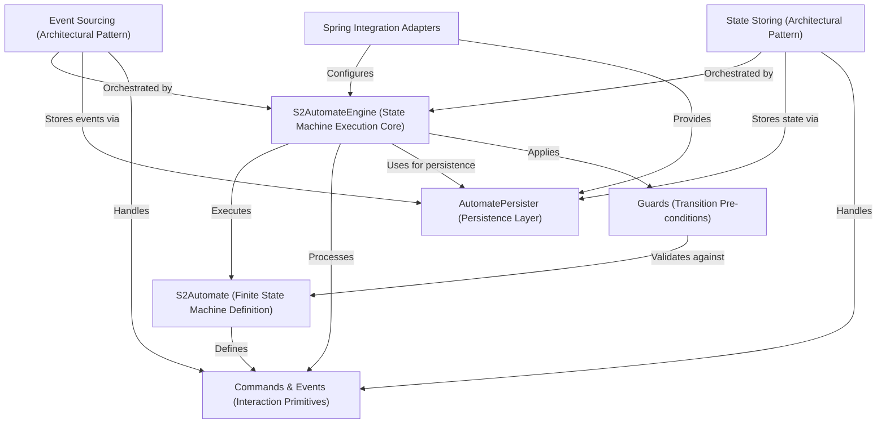

# Tutorial: fixers-s2

S2 is a Kotlin framework for modeling how things change *state* over time (like an order moving from 'placed' to 'shipped'). It uses **Finite State Machines (FSMs)** to define these allowed changes, which are triggered by *Commands*. S2 offers two main ways to manage data: **Event Sourcing** (saving every change as an *Event*) or **State Storing** (saving only the current *State*). It's designed to integrate smoothly with the Spring ecosystem for building robust applications.

**Source Repository:** [https://github.com/komune-io/fixers-s2](https://github.com/komune-io/fixers-s2)

## Chapters

1. [S2Automate (Finite State Machine Definition)
](01_s2automate__finite_state_machine_definition__.md)
2. [Commands & Events (Interaction Primitives)
](02_commands___events__interaction_primitives__.md)
3. [Guards (Transition Pre-conditions)
](03_guards__transition_pre_conditions__.md)
4. [S2AutomateEngine (State Machine Execution Core)
](04_s2automateengine__state_machine_execution_core__.md)
5. [AutomatePersister (Persistence Layer)
](05_automatepersister__persistence_layer__.md)
6. [Event Sourcing (Architectural Pattern)
](06_event_sourcing__architectural_pattern__.md)
7. [State Storing (Architectural Pattern)
](07_state_storing__architectural_pattern__.md)
8. [Spring Integration Adapters
](08_spring_integration_adapters_.md)

---

Generated by [AI Codebase Knowledge Builder](https://github.com/The-Pocket/Tutorial-Codebase-Knowledge)